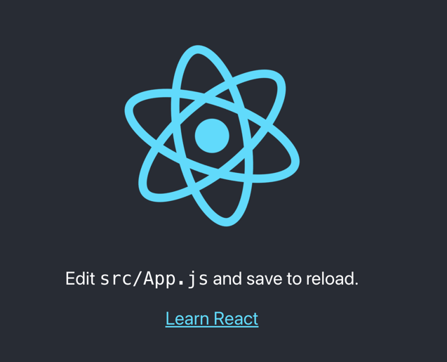
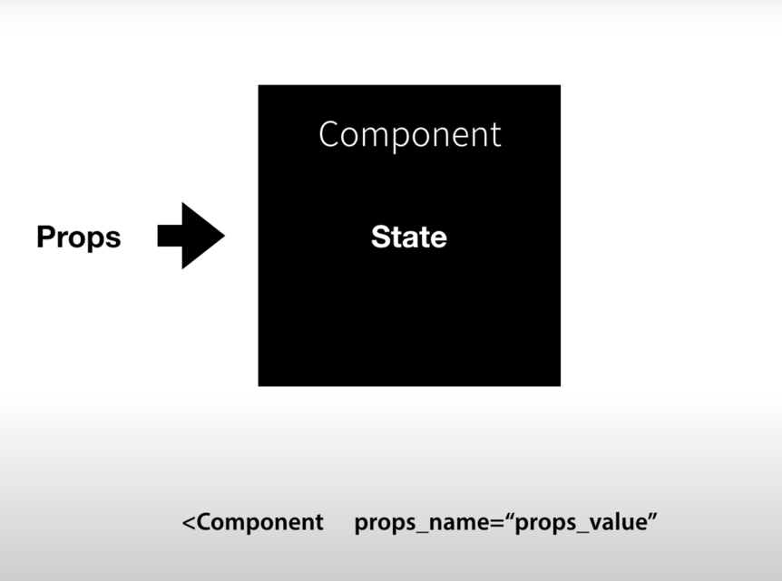

# react-basic

- `react` : 페이스북의 UI를 더 잘 만들기 위해 페이스북에서 만든 자바스크립트 UI 라이브러리

- `사용자 정의 태그`를 만들어주는 여러가지 기술이 있는데 리액트 역시도 그런 기술 중에 하나이다.
- 리액트에서 `사용자 정의 태그` 를 `Component` 라고 부른다.

`Component 기능` : 가독성, 재사용성, 유지보수

### npm
- `npm` : Node.js라는 기술을 이용해서 만들어진 여러 앱을 명령어 환경에서 아주 손쉽게 설치할 수 있게 도와주는 도구 즉, Node.js계의 앱스토어, 구글 플레이 같은 역할을 하는 소프트웨어.

### npx
`npx` : 프로그램을 임시로 설치해서 딱 한 번만 실행시키고 지운다고 생각.
- 컴퓨터 공간을 낭비하지 않는다.
- 설치를 실행할 때마다 새로 다운로드하기 때문에 항상 최신 상태이다 .

### JSX
`JSX`는 자바스크립트의 확장 문법. XML과 매우 비슷하게 생겼으며, 이런 형식으로 작성한 코드는 브라우저에서 실행되기 전에 코드가 번들링되는 과정에서 바벨을 사용하여 일반 자바스크립트 형태의 코드로 변환된다.

### Props
`Props` : Html 태그 속성(attribute) 같은 것. react에서는 props라 부름. 
- 속성값을 나타내는 키워드.

### State
`State` : Props에 값에 따라서 내부에 구현에 필요한 데이터들. 컴포넌트 내부적으로 사용되는 것들.

`Props`를 사용했는데도 `State`를 사용하는 이유는, 사용하는 쪽과 구현하는 쪽을 철저하게 분리시켜서 양쪽의 편의성을 각자 도모하는 것에 있다.

**_외부에서 알 필요가 없는 정보를 철저하게 은닉하는 것, 철저하게 숨기는 것이 좋은 사용성을 만드는 핵심._**

_**사용자 입장에서 알아야 할 것만 알면 된다.**_

 