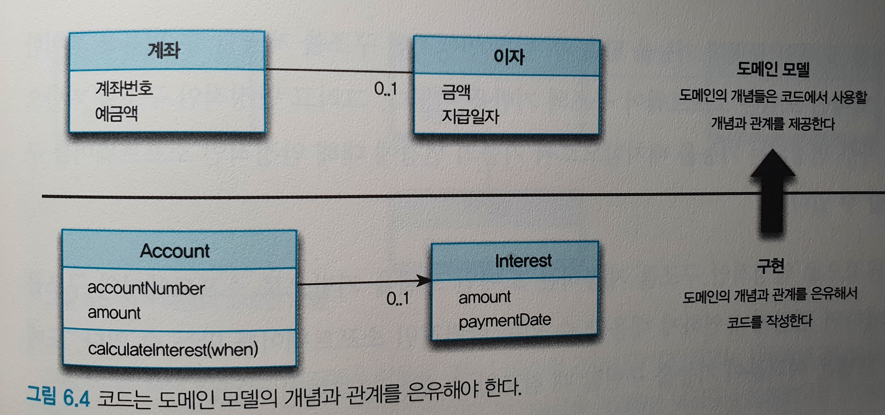

> 조영호님의 [객체지향의 사실과 오해]를 공부하고 정리한 내용 입니다.
 
## 서문
- 객체지향으로 향하는 첫걸음은 클래스가 아니라 객체를 바라보는 것에서부터 시작합니다.
- 두 번째 걸음은 객체를 독립적인 존재가 아니라 기능을 구현하기 위해 **협력하는 공동체**의 존재로 바라보는 것입니다.
- 세 번째 걸음을 내디딜 수 있는지는 협력에 참여하는 객체들에 얼마나 적절한 역할과 책임을 부여할 수 있느냐에 달려 있습니다.
- 마지막 걸음은 앞에서 설명한 개념들을 여러분이 사용하는 프로그래밍 언어라는 틀에 흐트러짐 없이 담아낼 수 있는 기술을 익히는 것입니다.

# 01. 협력하는 객체들의 공동체

> 시너지를 생각하라. 전체는 부분의 합보다 크다. - 스티븐 코비(Stephen R. Covey)

객체지향의 목표는 실세계를 모방하는 것이 아니다. 오히려 새로운 세계를 창조하는 것.

소프트웨어 개발자의 역할은 단순히 실세계를 소프트웨어 안으로 옮겨 담는 것이 아니라 고객과 사용자를 만족시킬 수 있는 신세계를 창조하는 것.

## 협력하는 사람들

실생활에 비유를 해보자.
- 커피를 주문하는 손님, 주문을 받는 캐시어, 커피를 제조하는 바리스타라는 **역할**이 존재한다.
- 손님, 캐시어, 바리스타는 주문한 커피를 손님에게 제공하기 위해 협력하는 과정에서 자신이 맡은 바 **책임**을 다한다.
- 커피 주문이라는 **협력**에 참여하는 모든 사람들은 **요청**(request)과 **응답**(response)을 통해 커피가 정확하게 주문되고 주문된 커피가 손님에게 정확하게 전달될 수 있도록 맡은 바 **역할과 책임**을 다하고 있는 것.

요청과 응답을 통해 다른 사람과 협력(collaboration)할 수 있는 능력은 인간으로 하여금 거대하고 복잡한 문제를 해결할 수 있는 공동체를 형성할 수 있게 만든다.
협력의 성공은 특정한 역할을 맡은 각 개인이 얼마나 요청을 성실히 이행하는가에 달려 있다.

객체지향에서 가장 중요한 개념 세 가지. **역할, 책임, 협력**

### 역할과 책임

역할을 어떤 협력에 참여하는 특정한 사람이 협력 안에서 차지하는 책임이나 임무를 의미한다.
**역할**이라는 단어는 의미적으로 **책임**이라는 개념을 내포한다.

예시로,
- 범죄자를 검거할 책임을 거부하는 사람에게 경찰관이라는 역할을 부여할 사람은 아무도 없을 것.
- 우리가 프로그래머라는 역할을 맡을 수 있는 이유는 훌륭한 프로그램을 개발할 책임을 기꺼이 받아들이기 때문

특정한 역할은 특정한 책임을 암시한다. 역할과 책임은 협력이 원할하게 진행되는 데 필요한 핵심적인 구성 요소.

협력을 위해 특정한 역할을 맡고 역할에 적합한 책임을 수행한다는 사실은 몇 가지 중요한 개념을 제시한다.
- 여러 사람이 동일한 역할을 수행할 수 있다.
- 역할은 대체 가능성을 의미한다.
- 책임을 수행하는 방법은 자율적으로 선택할 수 있다.
    - 커피 제조를 요청받은 바리스타는 자신만의 독특한 방법으로 커피를 제조할 수 있다. 이처럼 동일한 요청에 대해 서로 다른 방식으로 응답할 수 있는 능력을 **다형성**(**polymorphism**)이라고 한다.
- 한 사람이 동시에 여러 역할을 수행할 수 있다.

## 역할, 책임, 협력

### 기능을 구현하기 위해 협력하는 객체들

앞에서 사람이라는 단어를 **객체**로, 에이전트의 요청을 **메시지**로, 에이전트가 요청을 처리하는 방법을 **메소드**로 바꾸면 마법처럼 대부분의 설명을 객체지향이라는 문맥으로 옮겨올 수 있다.
이것이 바로 많은 사람들이 객체지향을 설명하기 위해 실세계이 모방이라는 은유를 차용하는 이유다.

### 역할과 책임을 수행하며 협력하는 객체들

협력의 핵심은 특정한 책임을 수행하는 역할들 간의 연쇄적인 요청과 응답을 통해 목표를 달성한다는 것.
일상생활에서 목표는 사람들의 협력을 통해 달성되며, 목표는 **더 작은 책임으로 분할**되고 책임을 수행할 수 있는 적절한 역할을 가진 사람에 의해 수행된다.
협력에 참여하는 각 개인은 책임을 수행하기 위해 다른 사람에게 도움을 요청하기도 하며, 이를 통해 연쇄적인 요청과 응답으로 구성되는 협력 관계가 완성된다.

객체의 세계는 인간의 세계와 유사하다.`워드 커닝험(Ward Cunningham)과 켄트 백(Kent Beck)`의 말을 인용하면 `"어떠한 객체도 섬이 아니다[Beck 1989]"`.

객체 공동체 안에 살고 있는 성실한 객체 시민은 자신에게 주어진 역할과 책임을 다하는 동시에 시스템의 더 큰 목적을 이루기 위해 **다른 객체와도 적극적으로 협력**한다.

결론적으로 시스템은 역할과 책임을 수행하는 객체로 분할되고 시스템의 기능은 객체 간의 연쇄적인 요청과 응답의 흐름으로 구성된 협력으로 구현된다.

객제치향 설계라는 예술은 적절한 **객체에게 적절한 책임을 할당하는 것에서 시작**된다.
책임은 객체지향 설계의 품질을 결정하는 가장 중요한 요소다. 책임이 불분명한 객체는 애플리케이션의 미래 역시 불분명하게 만든다.
얼마나 적절한 책임을 선택하느냐가 애플리케이션의 아름다움을 결정한다.

- 역할은 관련성 높은 책임의 집합이다.
- 역할은 유연하고 재사용 가능한 협력 관계를 구축하는 데 중요한 설계 요소이다.

## 협력 속에 사는 객체

객체지향 어플리케이션의 윤곽을 결정하는 것은 역할, 책임, 협력이지만 실제로 협력에 참여하는 주체는 **객체**다.
객체지향을 객체지향이라고 부르는 이유는 패러다임의 중심에 객체가 있기 때문.

객체는 애플리케이션의 기능을 구현하기 위해 존재한다. 객체지향 어플리케이션의 아름다움을 결정하는 것이 협력이라면 협력이 얼마나 조화를 이루는지를 결정하는 것은 객체다.
결국 협력의 품질은 결정하는 것은 객체의 품질이다.

협력 공동체의 일원으로서 객체는 다음과 같은 두 가지 덕목을 갖춰야 하며, 두 덕목 사이에서 균형을 유지해야 한다.

`첫째`, 객체는 충분히 '협력적'이어야 한다. 객체는 다른 객체의 요청에 충실히 귀 기울이고 다른 객체에게 적극적으로 도움을 요청할 정도로 열린 마음을 지녀야 한다.
외부의 도움을 무시한 채 모든 것을 스스로 처리하려고 하는 전지전능한 객체는 내부적인 복잡도에 의해 자멸하고 만다.
여기서 충분히 협력적이라는 말이 다른 객체의 명령에 따라 행동하는 수동적인 존재를 의미하는 것은 아니라는 사실에 주의하라.
객체는 다른 객체의 명령에 복종하는 것이 아니라 요청에 응답할 뿐이다. 어떤 방식으로 응답할지는 객체 스스로 판단하고 결정한다. 심지어 요청에 응할지 여부도 객체 스스로 결정할 수 있다.

`둘째`, 객체가 충분히 '자율적'이어야 한다는 것이다. '자율적'이라는 단어의 뜻은 '자기 스스로의 원칙에 따라 어떤 일을 하거나 자기 스스로를 통제하여 절제하는 것'을 의미한다.
어떤 사물이 자신의 행동을 스스로 결정하고 책임진다면 우리는 그 사물을 자율적인 존재라고 말한다.

객체지향 설계의 묘미는 다른 객체와 조화롭게 협력할 수 있을 만큼 충분히 개방적인 동시에 협력에 참여하는 방법을 스스로 결정할 수 있을 만큼 충분히 자율적인 객체들의 공동체를 설계하는 데 있다.

### 상태와 행동을 함께 지닌 자율적인 객체

흔히 객체를 상태(state)와 행동(behavior)을 함께 지닌 실체라고 정의한다. 이 말은 객체가 협력에 참여하기 위해 어떤 행동을 해야 한다면 그 행동을 하기 위한 필요한 상태도 함께 지니고 있어야 한다는 것을 의미한다.

객체의 자율성은 객체의 내부와 외부를 명확하게 구분하는 것으로부터 나온다. 객체의 사적인 부분은 객체 스스로 관리하고 외부에서 일체 간섭할 수 없도록 차단해야 하며, 객체의 외부에서는 접근이 허락된 수단을 통해서만 객체와 의사소통해야 한다.
객체는 다른 객체가 '무엇(what)'을 수행하는지는 알 수 있지만 '어떻게(how)' 수행하는지에 대해서는 알 수 없다.

객체의 관점에서 자율성이란 자신의 상태를 직접 관리하고 상태를 기반으로 스스로 판단하고 행동할 수 있음을 의미한다.
객체는 행동을 위해 필요한 상태를 포함하는 동시에(바리스타는 커피 제조 방법을 기억하고 있다) 특정한 행동을 수행하는 방법을 스스로 결정할 수 있어야 한다(바리스타는 자신이 알고 있는 방법에 따라 커피를 제조한다).
따라서 객체는 상태와 행위를 하나의 단위로 묶는 자율적인 존재다.

자율적인 객체로 구성된 공동체는 유지보수가 쉽고 재사용이 용이한 시스템을 구축할 수 있는 가능성을 제시한다.

### 협력과 메시지

풍부한 매커니즘을 이용해 요청하고 응답할 수 있는 인간들의 세계와 달리 객체지향의 세계에서는 오직 한 가지 의사소통 수단만이 존재한다.
이를 **메시지**라고 한다. 한 객체가 다른 객체에게 요청하는 것을 메시지를 전송한다고 말하고 다른 객체로부터 요청을 받는 것을 메시지를 수신한다고 말한다.

객체지향의 세계에서 협력은 메시지를 전송하는 객체와 메시지를 수신하는 객체 사이의 관계로 구성된다. 이때 메시지를 전송하는 객체를 **송신자**(**sender**)라고 부르고 메시지를 수신하는 객체를 **수신자**(**receiver**)라고 부른다.

### 메서드와 자율성

객체는 다른 객체와 협력하기 위해 메시지를 전송한다. 수신자는 먼저 수신된 메시지를 이해할 수 있는지 여부를 판단한 후 미리 정해진 자신만의 방법에 따라 메시지를 처리한다.
이처럼 객체가 수신된 메시지를 처리하는 방법을 **메서드**(**method**)라고 부른다.

메시지와 메서드의 분리는 객체의 협력에 참여하는 객체들 간의 자율성을 증진시킨다.
커피를 주문하는 협력 과정을 객체지향의 개념에 비유하면 바리스타로 전달된 커피 제조 요청이 메시지이고 커피를 제조하는 구체적인 방법이 메서드다.
바리스타는 커피 제조라는 메시지에 응답하기 위해 자신만의 자율적인 방법에 따라 커피를 제조할 수 있다.

외부의 요청이 무엇인지를 표현하는 메시지와 요청을 처리하기 위한 구체적인 방법인 메서드를 분리하는 것은 객체의 자율성을 높이는 핵심 매커니즘이다. (요청에 구체적인 방법을 함께 제시하는 것은 객체의 수동적인 태도를 강요하는 것이기에 객체의 자율성이 낮아진다.)
이것은 캡슐화(encapsulation)라는 개념과도 깊이 관련돼 있다.

## 객체지향의 본질

- 객체지향이란 시스템을 상호작용하는 **자율적인 객체들의 공동체**로 바라보고 객체를 이용해 시스템을 분할하는 방법이다.
- 자율적인 객체란 **상태**와 **행위**를 함께 지니며 스스로 자기 자신을 책임지는 객체를 의미한다.
- 객체는 시스템의 행위를 구현하기 위해 다른 객체와 **협력**한다. 각 객체는 협력 내에서 정해진 **역할**을 수행하며 역할은 관련된 **책임**의 집합이다.
- 객체는 다른 객체와 협력하기 위해 메시지를 전송하고, **메시지**를 수신한 객체는 메시지를 처리하는 데 적합한 **메서드**를 자율적으로 선택한다.

### 객체를 지향하라

훌륭한 객체지향 설계자가 되기 위해 거쳐야 할 첫 번째 도전은 코드를 담는 클래스의 관점에서 메시지를 주고받는 객체의 관점으로 사고의 중심을 전환하는 것이다.
중요한 것은 어떤 클래스가 필요한가가 아니라 어떤 객체들이 어떤 메시지를 주고받으며 협력하는가다. 클래스는 객체들의 협력 관계를 코드로 옮기는 도구에 불과하다.

널리 알려진 미신과 달리 객체지향의 핵심은 클래스가 아니다. 핵심은 **적절한 책임을 수행하는 역할 간의 유연하고 견고한 협력 관계를 구축하는 것**이다.
클래스는 협력에 참여하는 객체를 만드는 데 필요한 구현 매커니즘일 뿐이다. 클래스가 중요하지 않다는 것이 아니라 단지 협력 구조와 책임을 식별하는 것에 비해 상대적으로 덜 중요하다는 것을 말하고 싶은 것이다.
객체지향의 중심에는 클래스가 아니라 객체가 위치하며, 중요한 것은 클래스들의 정적인 관계가 아니라 메시지를 주고받는 객체들의 동적인 관계다.

클래스의 구조와 메서드가 아니라 객체의 역할, 책임 협력에 집중하라. 객체지향은 객체를 지향하는 것이지 클래스를 지향하는 것이 아니다.

# 02. 이상한 나라의 객체

> 객체지향 패러다임은 지식을 추상화하고 추상화한 지식을 객체 안에 캡슐화함으로써 실세계 문제에 내재된 복잡성을 관리하려고 한다. 객체를 발견하고 창조하는 것은 지식과 행동을 구조화하는 문제다. - 레베카 워프스브록(Rebecca Wirts-Brock)[Wirfs-Brock 1990]
 
## 객체지향과 인지 능력

세상을 더 작은 객체로 분해하는 것은 본질적으로 세상이 포함하고 있는 복잡성을 극복하기 위한 인간의 작은 몸부림이다.
인간은 좀 더 단순한 객체들로 주변을 분해함으로써 자신이 몸담고 있는 세상을 이해하려고 노력한다. 즉, 객체란 인간이 분명하게 인지하고 구별할 수 있는 물리적인 또는 개념적인 경계를 지닌 어떤 것이다.

소프트웨어 세계에서 살아가는 객체는 현실 세계에 존재하는 객체와는 전혀 다른 모습을 보이는 것이 일반적.

예시로, 현실 세계의 전등은 사람의 손길 없이는 스스로 불을 밝힐 수 없지만 소프트웨어 세계의 전등은 외부의 도움 없이도 스스로 전원을 켜거나 끌 수 있다.

## 객체, 그리고 이상한 나라

### 이상한 나라의 앨리스
아름다운 정원이 있는 작은 문을 통과하기 위해 온갖 고초를 겪은 앨리스의 애처로운 모습을 떠올리는 줄거리들을 설명하고 있다.

### 앨리스 객체

앨리스의 키는 앨리스가 '마셔라'라는 커다란 글자가 인쇄된 병 속의 음료를 마시거나 토끼가 털어뜨린 부채로 부채질을 하거나 쐐기벌레가 알려준 버섯의 한쪽 부분은 먹으면 작이지고, 상자 속의 케이크를 먹거나 버섯의 반대쪽 부분을 먹으면 커진다.
결국 앨리스의 키를 변화시키는 것은 앨리스의 **행동**이다.

앨리스의 상태를 결정하는 것은 행동이지만 행동의 결과를 결정하는 것은 상태이다. 앨리스가 한 행동의 결과는 앨리스의 **상태에 의존적**이다.

앨리스가 문을 통과한다는 행동의 결과는 앨리스의 위치라는 상태를 이용해 쉽게 설명할 수 있다. 앨리스가 문을 통과하는 데 성공했다면 앨리스의 위치는 아름다운 정원으로 바뀌어 있을 것.

어떤 행동의 성공 여부는 이전에 어떤 행동들이 발생했는지에 영향을 받는다는 사실도 눈여겨보기 바란다.

앨리스의 키가 작아지더라도 혹은 커지더라도 주변 사람들은 앨리스를 앨리스라고 부른다. 따라서 앨리스는 상태 변경과 무관하게 유일한 존재로 식별 가능하다.

`앨리스의 특징`
- 앨리스는 상태를 가지며 상태는 변경 가능하다.
- 앨리스의 변경시키는 것은 앨리스의 행동이다
  - 행동의 결과는 상태에 의존적이며 상태를 이용해 서술할 수 있다.
  - 행동의 순서가 결과에 영향을 미친다.
- 앨리스는 어떤 상태에 있더라도 유일하게 식별 가능하다.

## 객체, 그리고 소프트웨어 나라

하나의 개별적인 실체로 식별 가능한 물리적인 또는 개념적인 사물은 어떤 것이라도 객체가 될 수 있다.
인간의 인지 능력 안에서 개수를 셀수 있고, 다른 사물과 구분할 수 있으며, 생성 시점을 알 수 있고, 독립적인 하나의 단위로 인식할 수 있는 모든 사물은 객체다.
객체의 다양한 특성을 효과적으로 설명하기 위해서는 객체를 상태(state), 행동(behavior), 식별자(identity)를 지닌 실체로 보는 것이 가장 효과적이다[Booch 2007].

이 책에서는 객체를 다음와 같이 정의하기로 한다.
```text
객체란 식별 가능한 개체 또는 사물이다. 객체는 자동차처럼 만질 수 있는 구체적인 사물일 수도 있고, 시간처럼 추상적인 개념일 수도 있다.
객체는 구별 가능한 식별자, 특징적인 행동, 변경 가능한 상태를 가진다. 소프트웨어 안에서 객체는 저장된 상태와 실행 가능한 코드를 통해 구현된다.
```
### 상태

###### 왜 상태가 필요한가

객체가 주변 환경과의 상호작용에 어떻게 반응하는가는 그 시점까지 객체에 어떤 일이 발생했느냐에 좌우된다.

예시로, 
- 비행기 탑승여부? -> 과거에 항공권을 발권하는 행동이 발생했는지 여부에 따라 달라지는 것이다.

어떤 행동의 결과는 과거에 어떤 행동들이 일어났었느냐에 의존한다는 것인데 일반적으로 과거에 발생한 행동의 이력을 통해 현재 발생한 행동의 결과를 판단하는 방식은 복잡하고 번거로우며 이해하기 어렵다. 따라서 인간은 행동의 과정과 결과를 단순하게 기술하기 위해 상태라는 개념을 고안했다.
상태를 이용하면 과거의 모든 행동 이력을 설명하지 않고도 행동의 결과를 쉽게 예측하고 설명할 수 있다. 앨리스가 과거에 어떤 행동을 했었는지 모르더라도 앨리스의 키만 알면 문을 통과할 수 있는지 여부를 쉽게 판단할 수 있다.

상태를 이용하면 과거에 얽매이지 않고 현재를 기반으로 객체의 행동 방식을 이해할 수 있다. 상태는 근본적으로 세상의 복잡성을 완화하고 인지 과부하를 줄일 수 있는 중요한 개념이다.

###### 상태와 프로퍼티

세상에 존재하는 모든 것들이 객체인 것은 아니다. 분명하게 인식할 수 있음에도 객체의 영역에 포함시킬 수 없는 것들도 존재한다.
앨리스의 '키'와 '위치'는 객체가 아니다. 음료와 케이크의 '양'은 객체가 아니다. 문이 열려있는지 '여부'는 객체가 아니다. 토끼가 달려가는 '속도'역시 객체가 아니다.

숫자, 문자열, 양, 속도, 시간, 날짜, 참/거짓과 같은 단순한 값들은 객체가 아니다. 단순한 값들은 그 자체로 독립적인 의미를 가지기보다는 다른 객체의 특성을 표현하는 데 사용된다.
다시 말해 다른 객체의 상태를 표현하기 위해 사용된다. 비록 단순한 값은 객체가 아니지만 객체의 상태를 표현하기 위한 중요한 수단이다.

때로는 단순한 값이 아니라 객체를 사용해 다른 객체의 상태를 표현해야 할 때가 있다.
앨리스가 현재 음료를 들고 있는 상태인지를 표현하고 싶다고면 어떻게 할 것인가? 가장 간단하고 직관적인 방법은 앨리스의 상태 일부를 음료라는 객체를 이용해 표현하는 것이다.
앨리스가 음료를 들고 있는지 여부는 앨리스라는 객체가 음료라는 객체와 연결돼 있는지 여부로 표현할 수 있다. 객체지향 관점에서는 앨리스가 음료에 관해 알고 있는 상태라면 앨리스 객체와 음료 객체는 서로 연결돼 있다.

결론적으로 모든 객체의 상태는 단순한 값과 객체의 조합으로 표현할 수 있다. 이때 객체의 **상태를 구성하는 모든 특징을 통틀어** 객체의 프로퍼티(property)라고 한다.

객체와 객체 사이의 의미 있는 연결을 링크(link)라고 한다. 객체와 객체 사이에는 링크가 존재해야만 요청을 보내고 받을 수 있다. 즉, 객체의 링크를 통해서만 메시지를 주고받을 수 있다.
링크는 객체가 다른 객체를 참조할 수 있다는 것을 의미하며, 이것은 일반적으로 한 객체가 다른 객체의 식별자를 알고 있는 것으로 표현된다.

객체를 구성하는 단순한 값은 속성(attribute)이라고 한다. 앨리스의 키와 위치는 단순한 값으로 표현되기 때문에 속성이다.
객체의 프로퍼티(상태를 구성하는 모든 특징을 통틀어 일컫는 말)는 **단순한 값인 속성**과 **다른 객체를 가리키는 링크**라는 두 가지 종류의 조합으로 표현할 수 있다.

이 책에서는 객체의 상태를 다음와 같이 정의하기로 한다.
```text
상태는 특정 시점에 객체가 가지고 있는 정보의 집합으로 객체의 구조적 특징을 표현한다.
객체의 상태는 객체에 존재하는 정적인 프로퍼티와 동적인 프로퍼티 값으로 구성된다.
객체의 프로퍼티는 단순한 값(속성: attribute)과 다른 객체를 참조하는 링크로 구분할 수 있다.
```

객체는 자율적인 존재라는 점을 명심하라. 객체지향의 세계에서 객체는 다른 객체의 상태에 직접적으로 접근할 수도, 상태를 변경할 수도 없다.
자율적인 객체는 스스로 자신의 상태를 책임져야 한다. 외부의 객체가 직접적으로 객체의 상태를 주무를 수 없다면 간접적으로 객체의 상태를 변경하거나 조회할 수 있는 방법이 필요하다.

### 행동

###### <span style="color:yellow">상태와 행동</span>

객체의 상태는 저절로 변경되지 않는다. 객체의 상태를 변경하는 것은 객체의 자발적인 행동뿐이다.

객체가 취하는 행동은 객체 자신의 상태를 변경시킨다. 객체의 행동에 의해 객체의 상태가 변경된다는 것은 행동이 부수 효과(side effect)를 초래한다는 것을 의미한다.

상태와 행동 사이에는 다음과 같은 관계가 있음을 알 수 있다.
- 객체의 행동은 상태에 영향을 받는다.
- 객체의 행동은 상태를 변경시킨다.

이것은 상태라는 개념을 이용해 행동을 다음의 두 가지 관점에서 서술할 수 있음을 의미한다.
- 상호작용이 현재의 상태에 어떤 방식으로 의존하는가
- 상호작용이 어떻게 현재의 상태를 변경시키는가

앨리스가 문을 통과하는 행동을 상태 관점에서 설명해보자
- 앨리스의 키가 40센치미터 이하라면 문을 통과할 수 있다.
- 문을 통과한 후에 엘리스의 위치는 아름다운 정원으로 바뀌어야 한다.

상태를 이용해 객체의 행동을 얼마나 쉽고 우아하게 표현했는지 잘 살펴보기 바란다. 상태를 이용하면 복잡한 객체의 행동을 쉽게 이해할 수 있다.

###### <span style="color:yellow">협력과 행동</span>

어떤 객체도 섬이 아니다. 객체는 자신에게 주어진 책임을 완수하기 위해 다른 객체를 이용하고 다른 객체에게 서비스를 제공한다. 객체는 다른 객체와 적극적으로 상호작용 하며 '협력하는 객체들의 공동체'에  참여하기 위해 노력한다.

객체가 다른 객체와 협력하는 유일한 방법은 다른 객체에게 요청을 보내는 것이다. 요청을 수신한 객체는 요청을 처리하기 위해 적절한 방법에 따라 행동한다. 따라서 **객체의 행동은 객체가 협력에 참여할 수 있는 유일한 방법**이다.(요청의 메시지 처리를 행동으로 한다는 것은 행동으로 인해 협력을 한다는 것과 같다.)

객체가 다른 객체와 메시지를 통해서만 의사소통을 할 수 있다는 것을 기억하라. 객체가 어떤 행동을 하도록 만드는 것은 객체가 외부로부터 수신한 메시지다. 객체는 수신된 메시지에 따라 적절히 행동하면서 협력에 참여하고 그 결과로 자신의 상태를 변경한다.

객체의 행동은 이 두 가지 관점의 부수효과를 명확하게 서술해야 한다.
- 객체 자신의 상태 변경
- 행동 내에서 협력하는 다른 객체에 대한 메시지 전송

이 책에서는 행동을 다음과 같이 정의하기로 한다.
```text
행동이란 외부의 요청 또는 수신된 메시지에 응답하기 위해 동작하고 반응하는 활동이다.
행동의 결과로 객체는 자신의 상태를 변경하거나 다른 객체에게 메시지를 전달할 수 있다.
객체는 행동을 통해 다른 객체와의 협력에 참여하므로 행동은 외부에 가시적이어야 한다.
```

###### <span style="color:yellow">상태 캡슐화</span>

객체지향의 세계에서 모든 객체는 자신의 상태를 스스로 관리하는 자율적인 존재다.
앨리스 객체의 키를 작게 만드는 것이 앨리스 자신인 것처럼 음료 객체의 양을 줄이는 것은 음료 자신이어야 한다.
따라서 앨리스는 직접적으로 음료의 상태를 변경할 수 없다. 단지 음료에게 자신이 음료를 마셨다는 메시지를 전달할 수 있을 뿐이다.
적절한 정도의 음료의 양을 줄이는 것은 메시지를 전달받은 음료 스스로의 몫이다.

객체는 상태를 캡슐 안에 감춰둔 채 외부로 노출하지 않는다. 객체가 외부에 노출하는 것은 **행동**뿐이며, 외부에서 객체에 접근할 수 있는 유일한 방법 역시 **행동뿐**이다.

상태를 외부에 노출시키지 않고 행동을 경계로 캡슐화하는 것은 결과적으로 객체의 자율성을 높인다.
자율적인 객체는 스스로 판단하고 스스로 결정하기 때문에 객체의 자율성이 높아질수록 객체의 지능도 높아진다.
협력에 참여하는 객체들의 지능이 높아질수록 협력은 유연하고 간결해진다.

결론적으로 상태를 잘 정의된 행동 집합 뒤로 캡슐화하는 것은 객체의 자율성을 높이고 협력을 단순하고 유연하게 만든다. 이것이 상태를 캡슐화해야 하는 이유다.

### 식별자

객체란 인간의 인지 능력을 이용해 식별 가능한 경계를 가진 모든 사물을 의미한다.
객체가 식별 가능하다는 것은 객체를 서로 구별할 수 있는 특정한 프로퍼티가 객체 안에 존재한다는 것을 의미한다.
이 프로퍼티를 식별자라고 한다. 모든 객체는 식별자를 가지며 식별자를 이용해 객체를 구별할 수 있다.

객체가 가지는 프로퍼티의 타입은 객체나 단순한 값 중 하나가 될 수 있다고 설명했는데 값과 객체의 가장 큰 차이점은 값은 식별자를 가지지 않지만 객체는 식별자를 가진다는 점이다.
그리고 시스템을 설계 할 때는 이런 단순한 값과 객체의 차이점을 명확하게 구분하고 명시적으로 표현하는 것이 매우 중요하다.

**값**(**value**)은 숫자, 문자열, 날짜, 시간, 금액 등과 같이 변하지 않는 양을 모델링한다.
흔히 값의 상태는 변하지 않기 때문에 불변 상태(immutable state)를 가진다고 말한다.
값의 경우 두 인스턴스의 상태가 같다면 두 인스턴스를 같은 것으로 판단한다. 이 처럼 상태를 이용해 두 값이 같은지 판단할 수 있는 성질을 **동등성**(**equality**)이라고 한다.

**객체**는 시간에 따라 변경되는 상태를 포함하며, 행동을 통해 상태를 변경한다. 따라서 객체는 가변 상태(mutable state)를 가진다고 말한다.
타입이 같은 두 객체의 상태가 완전히 똑같더라도 두 객체는 독립적인 별개의 객체로 다뤄야 한다.

객체 역시 사람과 유사하게 상태와 무관하게 두 객체를 동일하거나 다르다고 판단할 수 있는 프로퍼티를 가진다. 두 객체의 상태가 다르더라도 식별자가 같다면 두 객체를 같은 객체로 판단할 수 있다.
이처럼 식별자를 기반으로 객체가 같은지를 판단할 수 있는 성질을 동일성(identical)이라고 한다.

```textmate
식별자란 어떤 객체를 다른 객체와 구분하는 데 사용하는 객체의 프로퍼티다.
값은 식별자를 가지지 않기 때문에 상태를 이용한 동등성 검사를 통해 두 인스턴스를 비교해야 한다.
객체는 상태가 변경될 수 있기 때문에 식별자를 이용한 동일성 검사를 통해 두 인스턴스를 비교할 수 있다.
```

**참조 객체**(**reference object**). 또는 **엔티티**(**entity**)는 식별자를 지닌 전통적인 의미의 객체를 가리키는 용어다.
**값 객체**(**value object**)는 식별자를 가지지 않는 값을 가리키는 용어다.

객체 식별자의 개념은 객체지향 패러다임의 표현력을 높이는 데 중요한 역할을 한다. 객체지향의 세계는 상태가 변하지 않는 값과 상태가 변하는 객체들이 서로 균형을 맞추며 조화를 이루는 사회여야 한다.

### 객체의 특성

- 객체는 상태를 가지며 상태는 변경 가능하다.
- 객체의 상태를 변경시키는 것은 객체의 행동이다.
  - 행동의 결과는 상태에 의존적이며 상태를 이용해 서술할 수 있다.
  - 행동의 순서가 실행 결과에 영향을 미친다.
- 객체는 어떤 상태에 있더라도 유일하게 식별 가능하다.

## 기계로서의 객체

객체를 기계로서 바라보는 관점은 상태, 행동, 식별자에 대한 시각적인 이미지를 제공하고 캡슐화와 메시지를 통한 협력 관계를 매우 효과적으로 설명한다.

## 행동이 상태를 결정한다.

첫째, 상태를 먼저 결정할 경우 캡슐화가 저해된다. 상태에 초점을 맞출 경우 상태가 객체 내부로 깔끔하게 캡슐화되지 못하고 공용 인터페이스에 그대로 노출되버릴 확률이 높아진다.

둘째, 객체를 협력자가 아닌 고립된 섬으로 만든다. 객체가 필요한 이유는 애플리케이션의 문맥 내에서 다른 객체와 협력하기 위해서다.
불행하게도 상태를 먼저 고려하는 방식은 협력이라는 문맥에서 멀리 벗어난 채 객체를 설계하게 함으로써 자연스럽게 협력에 적합하지 못한 객체를 창조하게 된다.

셋째, 객체의 재사용성이 저하된다. 객체의 재사용성은 다양한 협력에 참여할 수 있는 능력에서 나온다. 상태에 초점을 맞춘 객체는 다양한 협력에 참여하기 어렵기 때문에 재사용성이 저하될 수밖에 없다.

협력에 참여하는 훌룽한 객체 시민을 양성하기 위한 가장 중요한 덕목은 상태가 아니라 행동에 초점을 맞추는 것.
객체는 다른 객체와 협력하기 위해 존재한다. 객체의 행동은 객체가 협력에 참여하는 유일한 방법이다. 따라서 **객체가 적합한지를 결정하는 것은 그 객체의 상태가 아니라 행동**이다.
결과적으로 우리가 애플리케이션 안에서 어떤 행동을 원하느냐가 어떤 객체가 적합한지를 결정한다. 객체의 적합성을 결정하는 것은 상태가 아니라 객체의 행동이다.

객체지향 설계는 애플리케이션에 필요한 협력을 생각하고 협력에 참여하는 데 필요한 행동을 생각한 후 행동을 수행할 객체를 선택하는 방식으로 수행된다.
행동을 결정한 후에야 행동에 필요한 정보가 무엇인지를 고려하게 되며 이 과정에서 필요한 상태가 결정된다. 따라서 먼저 객체의 행동을 결정하고 그 후에 행동에 적절한 상태를 선택하게 된다.

협력 안에서 객체의 행동은 결국 객체가 협력에 참여하면서 완수해야 하는 책임을 의미한다. 따라서 어떤 책임이 필요한가를 결정하는 과정이 전체 설계를 주도해야 한다.
책임-주도 설계(Responsibility-Driven Desing, RDD)[Wirfs-Brock 2003]는 협력이라는 문맥 안에서 객체의 행동을 생각하도록 도움으로써 **응집도 높고 재사용 가능한 객체**를 만들 수 있게 한다.

## 은유와 객체

### 두 번째 도시전설

추상화(abstraction)란 실제의 사물에서 자신이 원하는 특성만 취하고 필요 없는 부분을 추려 **핵심만 표현하는 행위**.

안타깝게도 객체지향 세계는 현실 세계의 단순한 모방이 아니다. 소프트웨어 안에 구현된 상품 객체는 실제 세계의 상품과는 전혀 다른 양상을 띤다.
소프트웨어 상품은 실제 세계의 상품이 하지 못하는 가격 계산과 같은 행동을 스스로 수행할 수 있다. 이것은 소프트웨어 상품이 실제 세계의 상품을 단순화하거나 추상화한 것이 아니라 특성이 전혀 다른 어떤 것임을 의미한다.

### 의인화

현실 속의 객체와 소프트웨어 객체 사이의 가장 큰 차이점은 무엇일까? 그것은 현실 속에서는 수동적인 존재가 소프트웨어 객체로 구현될 때는 **능동적으로** 변한다는 것이다.

객체지향 세계를 구축할 때 현실에서 가져온 객체들은 현실 속에서는 할 수 없는 어떤 일이라도 할 수 있는 전지전능한 존재가 된다.
레베카 워프스브록은 현실의 객체보다 더 많은 일을 할 수 있는 소프트웨어 객체의 특징을 의인화(anthropomorphism)라고 부른다.

### 은유

현실 세계와 객체지향 세계 사이의 관계를 좀 더 정확하게 설명할 수 있는 단어는 은유(metaphor)다[Noble 2002].

현실 세계의 개념을 빌리면, 이용해서 소프트웨어의 객체를 묘사하면 쉽게 이해하고 기억할 수 있게 된다. 은유 관계에 있는 실제 객체의 이름을 소프트웨어 객체의 이름으로 사용하면 표현적 차이를 줄여 소프트웨어의 구조를 쉽게 예측할 수 있다.
따라서 소프트웨어 객체에 대한 현실 객체의 은유를 효과적으로 사용할 경우 표현적 차이를 줄일 수 있으며, 이해하기 쉽고 유지보수가 용이한 소프트웨어를 만들 수 있다.
바로 이러한 이유로 모든 객체지향 지침서에는 현실 세계인 도메인에서 사용되는 이름을 객체에게 부여하라고 가이드하는 것이다.

### 이상한 나라를 창조하라

객체지향 설계자로서 우리의 목적은 현실을 모방하는 것이 아니다. 단지 이상한 나라를 창조하기만 하면 된다.
현실을 닮아야 한다는 어떤 제약이나 구속도 없다. 여러분이 창조한 객체의 특성을 상기시킬 수 있다면 현실 속의 객체의 이름을 이용해 객체를 묘사하라.
그렇지 않다면 깔끔하게 현실을 무시하고 자유롭게 여러분만의 새로운 세계를 창조하기 바란다.

# 03. 타입과 추상화

> 일단 컴퓨터를 조작하는 것이 추상화를 구축하고, 조작하고, 추론하는 것에 관한 모든 것이라는 것을 깨닫고 나면 (훌륭한) 컴퓨터 프로그램을 작성하기 위한 중요한 전제 조건은 추상화를 정확하게 다루는 능력이라는 것이 명확해진다. - 키스 데블린(Keith Devlin)[Devlin 2003]

헤리 백은 지하철을 이용하는 승객들을 면밀하게 관찰한 후 승객이 꼭 알아야 하는 사실만 정확하게 표현하고 몰라도 되는 정보는 무시함으로써 이해하기 쉽고 단순하며 목적에 부합하는 지하철 노선도를 창조해 낼 수 있었다.
해리 백의 가장 위대한 업적은 지하철 노선을 추상화한 것이다.

## 추상화를 통한 복잡성 극복

사람들은 본능적으로 이해하기 쉽고 예측 가능한 수준으로 현실을 분해하고 현실을 분해하고 단순화하는 전략을 따른다. 해리 벡이 고안한 추상화는 지형 정보를 제거하고 역 사이의 연결성을 강조함으로써 지하철 노선도를 이용하는 승객들의 목적에 맞게 현실을 단순화했다.

진정한 의미에서 추상화란 현실에서 출발하되 불필요한 부분을 도려내가면서 사물의 놀라운 본질을 드러나게 하는 과정이라고 할 수 있다[Root-bernstein 2001].
추상화의 목적은 불필요한 부분을 무시함으로써 현실에 존재하는 복잡성을 극복하는 것이다. 추상화는 복잡한 현실을 단순화하기 위해 사용하는 인간의 가장 기본적인 인지 수단이라고 할 수 있다.

훌륭한 추상화는 목적에 부합하는 것이어야 한다. 어떤 추상화도 의도된 목적이 아닌 다른 목적으로 사용된다면 오도될 수 있다. 추상화의 수준, 이익, 가치는 목적에 의존적이다.

이 책에서 추상화를 다음과 같이 정의한다.
```text
추상화

어떤 양상, 세부 사항, 구조를 좀 더 명확하게 이해하기 위해 특정 절차나 물체를 의도적으로 생략하거나 감춤으로써 복잡도를 극복하는 방법이다.
```

복잡성을 다루기 위해 추상화는 두 차원에서 이뤄진다[Kramer 2007].
- 첫 번째 차원은 구체적인 사물들 간의 공통점은 취하고 차이점은 버리는 일반화를 통해 단순하게 만드는 것이다.
- 두 번째 차원은 중요한 부분을 강조하기 위해 불필요한 세부 사항을 제거함으로써 단순하게 만드는 것이다.

모든 경우에 추상화의 목적은 복잡성을 이해하기 쉬운 수준으로 단순화하는 것이라는 점을 기억하라.

객체지향 패러다임은 객체라는 추상화를 통해 현실의 복잡성을 극복한다. 그리고 객체지향 패러다임을 이용해 유용하고 아름다운 애플리케이션을 개발하기 위한 첫걸음은 추상화의 두 차원을 올바르게 이해하고 적용하는 것이다.

## 객체지향과 추상화

### 모두 트럼프일 뿐

앨리스는 정원사들, 병사들, 왕자와 공주, 하객으로 참석한 왕과 왕비들, 하트 왕과 하트 여왕의 차이점은 과감하게 무시한 채 공통점만을 취해 단순화 해버렸다.
다양한 인물들을 계급, 나이, 성격 등의 차이점은 무시한 채 '트럼프'라는 유사성을 기반으로 추상화해서 바라보고 있는 것이다.

### 그룹으로 나누어 단순화하기

앨리스는 정원에 있는 인물들을 두 개의 그릅으로 나눴다. 하나는 트럼프의 그룹이고 또 다른 하나는 토끼의 그룹이다.
비록 토끼 그룹에 속하는 등장인물이 단 하나뿐이라고 해도 다수의 개별적인 인물이 아니라 '트럼프'와 '토끼'라는 두 개의 렌즈를 통해 정원을 바라보는 것은 정원에 내재된 복잡성을 효과적으로 감소시킨다.

### 개념

앨리스가 인물들의 차이점을 무시하고 공통점만을 취해 트럼프라는 개념으로 단순화한 것은 추상화의 일종이다.

공통점을 기반으로 객체들을 묶기 위한 그릇을 **개념**(**concept**)이라고 한다.
개념이란 일반적으로 우리가 인식하고 있는 다양한 사물이나 객체에 적용할 수 있는 아이디어나 관념을 뜻한다.

개념을 이용하면 객체를 여러 그룹으로 분류(classification)할 수 있다. 앨리스가 정원에 존재하는 객체를 '트럼프'와 '토끼'라는 두 개의 개념으로 나누고는 두 개념에 적합한 객체가 각 그룹에 포함되도록 분류했다는 사실에 주목하라.
결과적으로 개념은 공통점을 기반으로 객체를 분류할 수 있는 일종의 체라고 할 수 있다.

```text
객체란 특정한 개념을 적용할 수 있는 구체적인 사물을 의미한다.
개념이 객체에 적용됐을 때 객체를 개념의 인스턴스라고 한다.
```

개념은 객체를 분류할 수 있는 틀을 제공한다. 앨리스가 수많은 군상들을 단지 트럼프일 뿐이라고 일축했던 것처럼 주변의 복잡한 객체들은 단지 몇 가지 개념의 인스턴스일 뿐이다.

### 개념의 세 가지 관점

어떤 객체에 어떤 개념이 적용됐다고 할 때는 그 개념이 부가하는 의미를 만족시킴으로써 다른 객체와 함께 해당 개념의 일원이 됐다는 것을 의미한다.

일반적으로 객체의 분류 장치로서 개념을 이야기할 때는 아래의 세 가지 관점을 함께 언급한다[Marin 1998, Larman 2004].
- **심볼(symbol)**: 개념을 가리키는 간략한 이름이나 명칭
- **내연(intension)**: 개념의 완전한 정의를 나타내며 내연의 의미를 이용해 객체가 개념에 속하는지 여부를 확인할 수 있다.
- **외연(extension)**: 개념에 속하는 모든 객체의 집합(set)

개념을 이용해 객체를 분류할 수 있다는 사실이 중요하다. 개념을 이용해 공통점을 가진 객체들을 분류할 수 있다는 아이디어는 객체지향 패러다임이 복잡성을 극복하는 데 사용하는 가장 기본적인 인지 수단이기 때문이다.

객체지향의 세계에서 가장 널리 알려진 유명인사 클래스(class)라는 사실을 감안한다면 분류(classification)라는 개념이 얼마나 중요한지 실감할 수 있을 것이다.

### 객체를 분류하기 위한 틀

```text
분류란 객체에 특정한 개념을 적용하는 작업이다.
객체에 특정한 개념을 적용하기로 결심했을 때 우리는 그 객체를 특정한 집합의 멤버로 분류하고 있는 것이다.
```

분류는 객체지향의 가장 중요한 개념 중 하나다. 어떤 객체를 어떤 개념으로 분류할지가 객체지향의 품질을 결정한다.
객체를 적절한 개념에 따라 분류하지 못한 애플리케이션은 유지보수가 어렵고 변화에 쉽게 대처하지 못한다. 반면에 객체를 적절한 개념에 따라 분류한 애플리케이션은 유지보수가 용이하고 변경에 유연하게 대처할 수 있다.
더 중요한 것은 적절한 분류 체계는 애플리케이션을 다루는 개발자의 머릿속에 객체를 쉽게 찾고 조작할 수 있는 정신적인 지도를 제공한다는 것이다.

객체는 소중하다. 따라서 소중한 객체를 안전하고 적절한 장소에 보관할 수 있도록 여러분의 인지능력을 발휘해 **최대한 직관적으로 분류**하라.

### 분류는 추상화를 위한 도구다

추상화의 첫 번째 차원은 구체적인 사물 간의 공통점은 취하고 차이점은 버리는 일반화를 통해 단순화하는 것이다.
추상화의 두 번째 차원은 중요한 부분을 강조하기 위해 불필요한 세부 사항을 제거해 단순화하는 것이다.

## 타입

### 타입은 개념이다

타입은 공통점을 기반으로 객체들을 묶기 위한 틀이다.

```text
타입은 개념과 동일하다. 따라서 타입이란 우리가 인식하고 있는 다양한 사물이나 객체에 적용할 수 있는 아이디어나 관념을 의미한다.
어떤 객체에 타입을 적용할 수 있을 대 그 객체를 타입의 인스턴스라고 한다. 타입의 인스턴스는 타입을 구성하는 외연인 객체 집합의 일원이 된다.
```

### 데이터 타입

사람이 어떤 일을 수행하기 위해서는 장기 기억 속에 묻혀진 기억의 편린들을 단기 기억 속으로 불러들여야만 하는 것처럼 컴퓨터가 어떤 작업을 수행하기 위해서는 작업에 필요한 데이터를 메모리 안으로 불러들여야 한다.

```text
데이터 타입은 메모리 안에 저장된 데이터의 종류를 분류하는 데 사용하는 메모리 집합에 관한 메다데이터다.
데이터에 대한 분류는 암시적으로 어떤 종류의 연산이 해당 데이터에 대해 수행될 수 있는지를 결정한다.
```

### 객체와 타입

객체를 타입에 따라 분류하고 그 타입에 이름을 붙이는 것은 결국 프로그램에서 사용할 새로운 데이터 타입을 선언하는 것과 같다.

객체는 데이터인가? 그렇지 않다. 객체에서 중요한 것은 객체의 행동이다. 상태는 행동의 행동의 결과로 초래된 부수효과를 쉽게 표현하기 위해 도입한 추상적인 개념일 뿐이다.
객체를 창조할 때 가장 중요하게 고려해야 하는 것은 객체가 이웃하는 객체와 협력하기 위해 어떤 행동을 해야 할지를 결정하는 것이다. 즉, 객체가 협력을 위해 어떤 책임을 지녀야 하는지를 결정하는 것이 객체지향 설계의 핵심이다.

객체의 타입에 대한 조언

첫째, **어떤 객체가 어떤 타입에 속하는지를 결정하는 것은 객체가 수행하는 행동**이다.
어떤 객체들이 동일한 행동을 수행할 수 있다면 그 객체들은 동일한 타입으로 분류될 수 있다.

둘째, 객체의 내부적인 표현은 외부로부터 철저하게 감춰진다. 객체의 행동을 가장 효과적으로 수행할 수만 있다면 객체 내부의 상태를 어떤 방식으로 표현하더라도 무방하다.

두 가지 조언으로부터 객체지향 설계에 대한 중요한 원칙을 이끌어낼 수 있다.

### 행동이 우선이다

어떤 객체를 다른 객체와 동일한 타입으로 분류하는 기준은 무엇인가? 그 객체가 타입에 속한 다른 객체와 동일한 행동을 하기만 하면 된다.
그 객체가 어떤 데이터를 가지고 있는지는 우리의 관심사가 아니다. 그 객체가 다른 객체와 동일한 데이터를 가지고 있더라도 다른 행동을 한다면 그 객체들은 서로 다른 타입으로 분류돼야 한다.

결론적으로 객체의 타입을 결정하는 것은 객체의 행동뿐이다. 객체가 어떤데이터를 보유하고 있는지는 타입을 결정하는 데 아무런 영향도 미치지 않는다.

**다형성이란** 동일한 요청에 대해 서로 다른 방식으로 응답할 수 있는 능력을 뜻한다. 
동일한 메시지를 서로 다른 방식으로 처리하기 위해서는 객체들은 동일한 메시지를 수신할 수 있어야 하기 때문에 결과적으로 다형적인 객체들은 동일한 타입(또는 타입 계층)에 속하게 된다.

훌륭한 객체지향 설계는 외부에 행동만을 제공하고 데이터는 행동 뒤로 감춰야 한다. 이 원칙을 흔히 **캡슐화**라고 한다.
공용 인터페이스 뒤로 데이터를 캡슐화하라는 오래된 격언은 객체를 행동에 따라 분류하기 위해 지켜야 하는 기본적인 원칙이다.

행동에 따라 객체를 분류하기 위해서는 객체가 내부적으로 관리해야 하는 데이터가 아니라 객체가 외부에 제공해야 하는 행동을 먼저 생각해야 한다.
이를 위해서는 객체가 외부에 제공해야 하는 책임을 먼저 결정하고 그 책임을 수행하는 데 적합한 데이터를 나중에 결정한 후, 데이터를 책임을 수행하는 데 필요한 외부 인터페이스 뒤로 캡슐화해야 한다.
데이터를 먼저 결정하고 객체의 책임을 결정하는 방법은 유연하지 못한 설계라는 악몽을 초래한다. 흔히 책임-주도 설계(Responsibility-Driven Design)라고 부르는 객체지향 설계 방법은 데이터를 먼저 생각하는 데이터-주도 설계(Data-Driven Design) 방법의 단점을 개선하기 위해 고안됐다[Wirfs-Brock 1989].

객체를 결정하는 것은 행동이다. 데이터는 단지 행동을 따를 뿐이다. 이것이 객체를 객체답게 만드는 가장 핵심적인 원칙이다.

## 타입의 계층

### 트럼프 계층

트럼프 카드는 납작 엎드릴 수 있고 뒤집어질 수 있지만 걸을 수 없고 걸을 때마다 몸이 종이처럼 좌우로 펄럭이지 않는다.
트럼프 인간은 납작 엎들릴 수도, 뒤짚어질 수도, 걸을 수도 있고 걸을 떄마다 몸이 종이처럼 펄럭인다.

트럼프 인간은 트럼프보다 좀 더 특화된 행동을 하는 특수한 개념이다. 이 두 개념 사이의 관계를 **일반화/특수화**(**generalization/specialization**)관계라고 한다.

### 일반화/특수화 관계

객체지향에서 일반화/특수화 관계를 결정하는 것은 객체의 상태를 표현하는 데이터가 아니라 행동이라는 것이다.
즉, 객체의 일반화/특수화 관계에 있어서도 중요한 것은 객체가 내부에 보관한 데이터가 아니라 객체가 외부에 제공하는 행동이다.

행동의 관점에서 일반적인 타입은 특수한 타입보다 더 적은 수의 행동을 가지고 특수한 타입은 일반적인 타입보다 더 많은 수의 행동을 가진다.

### 슈퍼타입과 서브타입

다시 한 번 강조하지만 슈퍼타입과 서브타입에서 중요한 것은 두 타입 간의 관계가 행동에 의해 결정된다는 점이다.
즉, 어떤 타입이 다른 타입의 서브타입이 되기 위해서는 행위적 호환성을 만족시켜야 한다. 일반적으로 서브타입은 슈퍼타입의 행위와 호환되기 때문에 서브타입은 슈퍼타입을 대체할 수 있어야 한다.

### 일반화는 추상화를 위한 도구다

추상화의 두 번째 차원은 중요한 부분을 강조하기 위해 불필요한 세부 사항을 제거시켜 단순하게 만드는 것이다.
일반화/특수화 계층은 객체지향 패러다임에서 추상화의 두 번째 차원을 적절하게 활용하는 대표적인 예다.

## 정적 모델

### 타입의 목적

타입을 사용하는 이유는 인간의 인지 능력으로는 시간에 따라 동적으로 변하는 객체의 복잡성을 국복하기가 너무 어렵기 때문이다.

타입을 사용하면 동적으로 변하는 객체의 상태를 정적인 관점에서 표현할 수 있다.

### 그래서 결국 타입은 추상화다.

타입은 추상화다. 타입을 이용하면 객체의 동적인 특성을 추상화할 수 있다. 결국 타입은 시간에 따른 객체의 상태 변경이라는 복잡성을 단순화할 수 있는 효과적인 방법인 것이다.

### 동적 모델과 정적 모델

객체를 생각할 때는 우리는 두 가지 모델을 동시에 고려한다는 사실을 알 수 있다.

하나는 객체가 특정 시점에 구체적으로 어떤 상태를 가지느냐다. 이를 객체의 **스냅샷**(**snapshot**)[D'Souza 1998]이라고 한다.
객체지향 모델링을 위한 표준 언어인 UML에서 스냅샷은 객체 다이어그램(object diagram)[Fowler 2003]이라고도 불린다.
스냅샷처럼 실제로 객체가 살아 움직이는 동안 상태가 변하고 어떻게 행동하는지를 포착하는 것을 동적 모델(dynamic model)이라고 한다.

다른 하나는 객체가 가질 수 있는 모든 상태와 모든 행동을 시간에 독립적으로 표현하는 것이다.
일반적으로 이런 모델을 타입 모델(type diagram)[D'Souza 1998]이라고 한다.
이 모델은 동적으로 변하는 객체의 상태가 아니라 객체가 속한 타입의 정적인 모습을 표현하기 때문에 정적 모델(static model)이라고도 한다.

객체지향 프로그래밍 언어를 이용해 클래스를 작성하는 시점에는 시스템을 정적인 관점에서 접근하는 것이다.
그러나 실제로 애플리케이션을 실행해 객체의 상태 변경을 추적하고 디버깅하는 동안에는 객체의 동적인 모델을 탐험하고 있는 것이다.
훌륭한 객체지향 프로그래머라면 애플리케이션의 동적인 관점과 정적인 관점을 모두 다뤄야 한다는 사실을 쉽게 이해할 수 있을 것이다.

### 클래스

클래스와 타입은 동일한 것이 아니다. 타입은 객체를 분류하기 위해 사용하는 개념이다. 반면 클래스는 단지 타입을 구현할 수 있는 여러 구현 메커니즘 중 하나일 뿐이다.
실제로 자바스크립트와 같은 프로토타입 기반의 언어에는 클래스가 존재하지 않는다.

클래스와 타입을 구분하는 것은 설계를 유연하게 유지하기 위한 바탕이 된다. 클래스는 타입의 구현 외에도 코드를 재사용하는 용도로도 사용되기 때문에 클래스와 타입을 동일시하는 것은 수많은 오해와 혼란을 불러일으키곤 한다.

지금은 객체를 분류하는 기준은 타입이며, 타입을 나누는 기준은 객체가 수행하는 행동이라는 사실만을 기억하기 바란다. 객체를 분류하기 위해 타입을 결정한 후 프로그래밍 언어를 이용해 타입을 구현할 수 있는 한 가지 방법이 클래스라는 사실을 아는 것만으로도 충분하다.

결국 객체지향에서 중요한 것은 동적으로 변하는 객체의 '상태'와 상태를 변경하는 '행위'다. 클래스는 타입을 구현하기 위해 프로그래밍 언어에서 제공하는 구현 매커니즘이라는 사실을 기억하라.

# 04. 역할, 책임, 협력

> 객체지향 패러다임은 지식을 추상화하고 추상화한 지식을 객체 안에 캡슐화함으로써 실세계 문제에 내재된 복잡성을 관리하려고 한다. 객체를 발견하고 창조하는 것은 지식과 행동을 구조화하는 문제다. - 레베카 워프스브록(Rebecca Wirts-Brock)[Wirfs-Brock 1990]

객체의 세계에서도 협력이라는 문맥이 객체의 행동 방식을 결정한다.

중요한 것은 개별 객체가 아니라 객체들 사이에 이뤄지는 협력이다. 객체지향 설계의 전체적인 품질을 결정하는 것은 개별 객체의 품질이 아니라 여러 객체들이 모여 이뤄내는 협력의 품질이다.
훌륭한 객체지향 설계자는 객체들 간의 요청과 응답 속에서 창발하는 협력에 초점을 맞춰 애플리케이션을 설계한다. 협력이 자리를 잡으면 저절로 객체의 행동이 드러나고 뒤이어 적절한 객체의 상태가 결정된다.

## 협력

### 요청하고 응답하며 협력하는 사람들

협력의 본질은 요청과 응답으로 연결되는 사람들의 네트워크이다.

**협력**은 한 사람이 다른 사람에게 도움을 **요청**할 때 시작된다. 요청을 받은 사람은 일을 처리한 후 요청한 사람에게 필요한 지식이나 서비스를 제공하는 것으로 요청에 **응답**한다.

다른 사람으로부터 요청을 받은 사람 역시 자신에게 주어진 일을 처리하던 중에 다른 사람의 도움이 필요한 경우가 있다.
결과적으로 협력은 다수의 요청과 응답으로 구성되며 전체적으로 협력은 다수의 연쇄적인 요청과 응답의 흐름으로 구성된다.

### 누가 파이를 훔쳤지?

객체지향의 세계는 동일한 목적을 달성하기 위해 협력하는 객체들의 공동체라는 사실을 기억하라.

### 재판 속의 협력

요청과 응답은 협력에 참여하는 객체가 수행할 책임을 정의한다.

## 책임

객체지향의 세계에서는 어떤 객체가 어떤 요청에 대해 대답해 줄 수 있거나, 적절한 행동을 할 의무가 있는 경우 해당 객체가 **책임**을 가진다고 말한다.

> "객체지향 개발에서 가장 중요한 능력은 책임을 능숙하게 소프트웨어 객체에 할당하는 것" - [Larman 2004]

### 책임의 분류

협력에 참여하는 객체들은 목표를 달성하는 데 필요한 책임을 수행한다. 책임은 객체에 의해 정의되는 응집도 있는 행위의 집합으로, 객체가 알아야 하는 정보와 객체가 수행할 수 있는 행위에 대해 개략적으로 서술한 문장이다.
즉, 객체의 책임은 '객체가 무엇을 알고 있는가(knowing)'와 '무엇을 할 수 있는가(doing)'로 구성된다.

크레이그 라만은 이러한 분류 체계에 따라 객체의 책임을 크게 '하는 것'과 '아는 것'의 두 가지 범주로 자세히 분류하고 있다.[Larman 2004]
 
- 하는 것 (doing)
  - 객체를 생성하거나 계산을 하는 등의 스스로 하는 것
  - 다른 객체의 행동을 시작시키는 것
  - 다른 객체의 활동을 제어하고 조절하는 것

- 아는 것(knowing)
  - 개인적인 정보에 관해 아는 것
  - 관련된 객체에 관해 아는 것
  - 자신이 유도하거나 계산할 수 있는 것에 관해 아는 것

객체지향 설계의 예술은 적절한 객체에게 적절한 책임을 할당하는 데 있다.

객체의 책임을 이야기할 때는 일반적으로 외부에서 접근 가능한 공용 서비스의 관점에서 이야기한다.
즉, 책임은 객체의 외부에 제공해 줄 수 있는 정보(아는 것의 측면)와 외부에 제공해 줄 수 있는 서비스(하는 것의 측면)의 목록이다.
따라서 책임은 객체의 공용 인터페이스(public interface)를 구성한다.

### 책임과 메시지

객체가 다른 객체에게 주어진 책임을 수행하도록 요청을 보내는 것을 메시지 **전송**(**message-send**)이라고 한다.
따라서 두 객체 간의 협력은 메시지를 통해 이뤄진다. 메시지는 협력을 위해 한 객체가 다른 객체로 접근할 수 있는 유일한 방법이다.

한 가지 주의할 점은 책임과 메시지의 수준은 같지 않다는 점이다. **책임은 객체가 협력에 참여하기 위해 수행해야 하는 행위를 상위 수준에서 개략적으로 서술한 것**이다.
책임을 결정한 후 실제로 협력을 정제하면서 이를 메시지로 변환할 때는 하나의 책임이 여러 메시지로 분할되는 것이 일반적이다.

객체지향 설계는 협력에 참여하기 위해 어떤 객체가 어떤 책임을 수행해야 하고 어떤 객체로부터 메시지를 수신할 것인지를 결정하는 것으로부터 시작된다.
어떤 클래스가 필요하고 어떤 메서드를 포함해야 하는지를 결정하는 것은 책임과 메시지에 대한 대략적인 윤곽을 잡은 후에 시작해도 늦지 않다.

## 역할

### 책임의 집합이 의미하는 것

어떤 객체가 수행하는 책임의 집합은 객체가 협력 안에서 수행하는 역할을 암시한다.
역할은 재사용 가능하고 유연한 객체지향 설계를 낳는 매우 중요한 구성요소이다.

### 판사와 증인

증인과 재판인만 바뀌고 과정의 모든 것이 동일한 협력이 세 개가 있을 때 이 세 개의 협력을 별도로 관리하고 유지해야 할까?
만약 재판 과정이 바뀐다면 어떻게 해야 할까? 세 개의 협력 과정을 일일이 쫓아다니며 수정해야 할까?

### 역할이 답이다.

재판이라는 협력 과정 속에서 하트 왕과 하트 여왕은 '판사'의 역할을 수행한다.
모자 장수와 요리사, 그리고 앨리스는 '증인'의 역할을 수행한다. 따라서 '판사'와 '증인'이라는 역할(role)을 사용하면 세 가지 협력을 모두 포괄할 수 있는 하나의 협력으로 추상화할 수 있다.

역할은 협력 내에서 다른 객체로 대체할 수 있음을 나타내는 일종의 표식이다.
역할을 대체할 수 있는 객체는 동일한 메시지를 이해할 수 있는 객체로 한정된다.
메시지가 책임을 의미한다. (메시지를 보냈다는 것은 객체의 책임을 수행하도록 요청하는 것.)

동일한 역할을 수행하는 객체들이 동일한 메시지를 수신할 수 있기 때문에 동일한 책임을 수행할 수 있다는 것은 매우 중요한 개념이다.
이 개념을 제대로 이해해야만 객체지향이 제공하는 많은 장점을 누릴 수 있다.

역할의 개념을 사용하면 유사한 협력을 추상화해서 인지 과부하를 줄일 수 있다.
또한 다양한 객체들이 협력에 참여할 수 있기 때문에 협력이 좀 더 유연해지며 다양한 객체들이 동일한 협력에 참여할 수 있기 때문에 재사용성이 높아진다.
역할은 객체지향 설계의 단순성(simplicity), 유연성(flexibility), 재사용성(reusability)을 뒷받침하는 핵심 개념이다.

### 협력의 추상화

역할의 가장 큰 가치는 하나의 협력 안에 여러 종류의 객체가 참여할 수 있게 함으로써 협력을 **추상화**할 수 있다는 것이다.
협력의 추상화는 설계자가 다뤄야 하는 협력의 개수를 줄이는 동시에 구체적인 객체를 추상적인 역할로 대체함으로써 협력의 양상을 단순화한다.
결과적으로 애플리케이션의 설계를 이해하고 기억하기 쉬워진다.

역할을 이용하면 협력을 추상화함으로써 단순화할 수 있다. 구체적인 객체로 추상적인 역할을 대체해서 동일한 구조의 협력을 다양한 문맥에서 재사용할 수 있는 능력은 과거의 전통적인 패러다임과 구분되는 객체지향만의 힘이다.
그리고 그 힘은 근본적으로 역할의 대체 가능성에서 비롯된다.

### 대체 가능성

객체가 역할을 대체하기 위해서는 행동이 호환돼야 한다는 점에 주목하라.
객체가 역할을 대체 가능하기 위해서는 협력 안에서 역할이 수행하는 모든 책임을 동일하게 수행할 수 있어야 한다.

객체는 역할이 암시하는 책임보다 더 많은 책임을 가질 수 있다. 따라서 대부분의 경우에 객체의 타입과 역할 사이에는 **일반화/특수화 관계**가 성립하는 것이 일반적이다.

요약하면 역할의 대체 가능성은 행위 호환성을 의미하고, 행위 호환성은 동일한 책임의 수행을 의미한다.

## 객체의 모양을 결정하는 협력

### 흔한 오류

많은 사람들은 시스템에 필요한 데이터를 저장하기 위해 객체가 존재한다는 선입견을 가지고 있다.
물론 객체가 상태의 일부로 데이터를 포함하는 것은 사실이지만 데이터는 단지 객체가 행위를 수행하는 데 필요한 재료일 뿐이다.
객체가 존재하는 이유는 행위를 수행하며 협력에 참여하기 위해서다. 따라서 실제로 중요한 것은 **객체의 행동, 즉 책임**이다.

객체지향에 대한 두 번째 선입견은 객체지향이 클래스와 클래스 간의 관계를 표현하는 시스템의 정적인 측면에 중점을 둔다는 것이다.
중요한 것은 정적인 클래스가 아니라 협력에 참여하는 동적인 객체이며, 클래스는 단지 시스템에 필요한 객체를 표현하고 생성하기 위해 프로그래밍 언어가 제공하는 구현 매커니즘이라는 사실을 기억하라.
객체지향의 핵심은 클래스를 어떻게 구현할 것인가가 아니라 객체가 협력 안에서 어떤 책임과 역할을 수행할 것인지를 결정하는 것이다.

### 협력을 따라 흐르는 객체의 책임

올바른 객체를 설계하기 위해서는 먼저 견고하고 깔끔한 협력을 설계해야 한다.
협력을 설계한다는 것은 설계에 참여하는 객체들이 주고받을 요청과 응답의 흐름을 결정한다는 것을 의미한다.
이렇게 결정된 요청과 응답의 흐름은 객체가 협력에 참여하기 위해 수행될 책임이 된다.

일단 객체에게 책임을 할당하고 나면 책임은 객체가 외부에 제공하게 될 행동이 된다.
협력이라는 문맥에서 객체가 수행하게 될 적절한 책임, 즉 행동을 결정한 후에 그 행동을 수행하는데 필요한 데이터를 고민해야 한다.
그리고 객체가 협력에 참여하기 위해 필요한 데이터와 행동이 어느 정도 결정된 후에 클래스의 구현 방법을 결정해야 한다.

객체지향이 올바른 객체에 올바른 책임을 할당하는 것과 관련된 모든 것이라면 협력이라는 문맥 안에서 객체를 생각하는 것은 올바른 객체지향 애플리케이션을 구현하는 것과 관련된 모든 것이다.

객체지향 시스템에서 가장 중요한 것은 충분히 자율적인 동시에 충분히 협력적인 객체를 창조하는 것이다.
이 목표를 달성할 수 있는 가장 쉬운 방법은 객체를 충분히 협력적으로 만든 후에 협력이라는 문맥 안에서 객체를 충분히 자율적으로 만드는 것이다.

## 객체지향 설계 기법

### 책임-주도 설계

객체지향의 설계의 핵심은 올바른 책임을 올바른 객체에게 할당하는 것이다.

협조적이고 성실한 객체 시민들로 구성된 객체지향 시스템을 설계하는 절차는 다음과 같이 요약할 수 있다.
- 시스템이 사용자에게 제공해야 하는 기능인 시스템 책임을 파악한다.
- 시스템 책임을 더 작은 책임으로 분할한다.
- 분할된 책임을 수행할 수 있는 적절한 객체 또는 역할을 찾아 책임을 할당한다.
- 객체가 책임을 수행하는 중에 다른 객체의 도움이 필요한 경우 이를 책임질 적절한 객체 또는 역할을 찾는다.
- 해당 객체 또는 역할에게 책임을 할당함으로써 두 객체가 협력하게 된다.

### 디자인 패턴

패턴은 특정한 상황에서 설계를 돕기 위해 모방하고 수정할 수 있는 과거의 설계 경험이다.

일반적으로 디자인 패턴은 반복적으로 발생하는 문제와 그 문제에 대한 해법의 쌍으로 정의 된다.
패턴은 해결하려고 하는 문제가 무엇인지를 명확하게 서술하고, 패턴을 적용할 수 있는 상황과 적용할 수 없는 상황을 함께 설명한다.
패턴은 반복해서 일어나는 특정한 상황에서 어떤 설계가 왜(why) 더 효과적인지에 대한 이유를 설명한다.

디자인 패턴은 공통으로 사용할 수 있는 역할, 책임, 협력의 템플릿이다. 만약 특정한 상황에 적용 가능한 디자인 패턴을 잘 알고 있다면 책임-주도 설계의 절차를 순차적으로 따르지 않고도 시스템 안에 구현할 객체들의 역할과 책임, 협력 관계를 빠르고 손쉽게 포착할 수 있을 것이다.
디자인 패턴은 책임-주도 설계의 결과물인 동시에 지름길이다.

### 테스트-주도 개발

테스트-주도 개발의 기본 흐름은 실패하는 테스트를 작성하고, 테스트를 통과하는 가장 간단한 코드를 작성한 후(이 시간 동안에는 중복이 있어도 무방하다.), 리팩터링(Refactoring)[Fowler 1999]을 통해 중복을 제거하는 것이다.
테스트-주도 개발을 통해 '작동하는 깔끔한 코드(clean code that works)'를 얻을 수 있다.

테스트-주도 개발은 책임-주도 설계를 통해 도달해야 하는 목적지를 테스트라는 안전장치를 통해 좀 더 빠르고 견고한 방법으로 도달할 수 있도록 해주는 최상의 설계 프랙티스다.

테스트-주도 개발은 객체지향에 대한 깊이 있는 지식을 요구한다. 테스트를 작성하기 위해 객체의 메서드를 호출하고 반환값을 검증하는 것은 순간적으로 객체가 수행해야 하는 책임에 관해 생각한 것이다.
테스트에 필요한 간접 입력 값을 제공하기 위해 스텁(stub)을 추가하거나 간접 출력 값을 검증하기 위해 목 객체(mock object)를 사용하는 것은 객체와 협력해야 하는 협력자에 관해 고민한 결과를 코드로 표현한 것이다.

테스트-주도 개발은 책임-주도 설계의 기본 개념과 다양한 원칙과 프랙티스, 패턴을 종합적으로 이해하고 좋은 설계에 대한 감각과 경험을 길러야만 적용할 수 있는 설계 기법이다.
역할, 책임, 협력에 집중하고 객체지향의 원칙을 적용하려는 깊이 있는 고민과 노력을 통해서만 테스트-주도 개발의 혜택을 누릴 수 있다.

# 05. 책임과 메시지

> 의도는 "메시징"이다. 훌륭하고 성장 가능한 시스템을 만들기 위한 핵심은 모듈 내부의 속성과 행동이 어떠한가보다는 모듈이 어떻게 커뮤니케이션하는가에 달려 있다. - 앨런 케이[Kay 1998]

훌륭한 객체지향의 세계는 명확하게 정의된 역할과 책임을 지닌 객체들이 상호 협력하는 세계다.

## 자율적인 책임

### 설계의 품질을 좌우하는 책임

객체지향 공동체를 구성하는 기본 단위는 '자율적'인 객체다. 객체들은 애플리케이션의 기능을 구현하기 위해 협력하고, 협력 과정에서 각자 맡은 바 책임을 다하기 위해 자율적으로 판단하고 행동한다.

요청을 처리하기 위해 객체가 수행하는 행동을 **책임**이라고 한다. 따라서 자율적인 객체란 스스로의 의지와 판단에 따라 각자 맡은 책임을 수행하는 객체를 의미한다.

객체지향 설계의 아름다움은 적절한 책임을 적절한 객체에게 할당하는 과정 속에서 드러난다.
객체지향 애플리케이션을 설계하는 가장 널리 알려진 방법을 책임-주도 설계라고 부르는 이유는 적절한 책임의 선택이 전체 설계의 방향을 결정하기 때문이다.

적절한 책임이 자율적인 객체를 낳고, 자율적인 객체들이 모여 유연하고 단순한 협력을 낳는다.
따라서 협력에 참여하는 객체가 얼마나 자율적인지가 전체 애플리케이션의 품질을 결정한다.

### 자신의 의지에 따라 증언할 수 있는 자유

객체지향 세계는 자율적인 객체들의 공동체라는 점을 명심하라. 객체가 자율적이기 위해서는 객체에게 할당되는 책임의 수준 역시 자율적이어야 한다.

### 너무 추상적인 책임

포괄적이고 추상적인 책임을 선택한다고 해서 무조건 좋은 것은 아니다. 책임이 수행 방법을 제한할 정도로 너무 구체적인 것도 문제지만 협력의 의도를 명확하게 표현하지 못할 정도로 추상적인 것 역시 문제다.

추상적이고 포괄적인 책임은 협력을 좀 더 다양한 환경에서 재사용할 수 있도록 유연성이라는 축복을 내려준다. 그러나 책임은 협력에 참여하는 의도를 명확하게 설명할 수 있는 수준 안에서 추상적이어야 한다.

성급한 일반화의 오류를 피하고 현재의 문맥에 가장 적합한 책임을 선택할 수 있는 날카로운 안목을 기르기 바란다.

### '어떻게'가 아니라 '무엇'을

자율적인 책임의 특징은 객체가 '어떻게(how)'해야 하는가가 아니라 '무엇(what)'을 해야 하는가를 설명한다는 것이다.
'증언한다'라는 책임은 **모자 장수가 협력을 위해 '무엇'을 해야** 하는지 결정하지만 '어떻게'해야 하는지에 대해서는 전혀 언급하지 않는다.

### 책임을 자극하는 메시지

책임이라는 말 속에는 어떤 행동을 수행한다는 의미가 포함돼 있다.

객체가 자신에게 할당된 책임을 수행하도록 만드는 것은 외부에서 전달되는 요청이다.

사실 객체가 다른 객체에게 접근할 수 있는 유일한 방법은 요청을 전송하는 것뿐이다.
그리고 이 요청을 우리는 메시지라고 부른다. 메시지는 객체로 하여금 자신의 책임, 즉 행동을 수행하게 만드는 유일한 방법이다

## 메시지와 메서드

### 메시지

하나의 객체는 **메시지**를 전송함으로써 다른 객체에 접근한다. 메시지-전송 매커니즘은 객체가 다른 객체에 접근할 수 있는 유일한 방법이다.

```text
메시지 전송은 수신자, 메시지 이름, 인자의 조합이 된다.
```

근본적으로 메시지의 개념은 책임의 개념과 연결된다. 송신자는 메시지 전송을 통해서만 다른 객체의 책임을 요청할 수 있고, 수신자는 오직 메시지 수신을 통해서만 자신의 책임을 수행할 수 있다.
따라서 객체가 수신할 수 있는 메시지의 모양이 객체가 수행할 책임의 모양을 결정한다.

### 메서드

메시지를 처리하기 위해 내부적으로 선택하는 방법을 **메서드**라고 한다.
어떤 객체에게 메시지를 전송하면 결과적으로 메시지에 대응되는 특정 메서드가 실행된다.

메시지를 수신한 객체가 실행 시간에 메서드를 선택할 수 있다는 사실은 다른 프로그래밍 언어와 객체지향 프로그래밍 언어를 구분 짓는 핵심적인 특징 중 하나다.
이것은 프로시저 호출에 대한 실행 코드를 컴파일 시간에 결정하는 절차적인 언어와 확연히 구분되는 특징이다.

### 다형성

다형성이란 서로 다른 유형의 객체가 동일한 메시지에 대해 서로 다르게 반응하는 것을 의미한다.
좀 더 구체적으로 말해 서로 다른 타입에 속하는 객체들이 동일한 메시지를 수신할 경우 서로 다른 메서드를 이용해 메시지를 처리할 수 있는 매커니즘을 가리킨다.

다형성은 역할, 책임, 협력과 깊은 관련이 있다. 서로 다른 객체들이 다형성을 만족시킨다는 것은 객체들이 동일한 책임을 공유한다는 것을 의미한다.
즉, 송신자의 관점에서 다형적인 수신자들을 구별할 필요가 없으며 자신의 요청을 수행할 책임을 지닌다는 점에서 모두 동일하다.
다형성(다양한 형태(타입)의 객체가 동일한 메시지 요청이라면 처리를 한다.)

다형성은 객체들의 대체 가능성을 이용해 설계를 유연하고 재사용 가능하게 만든다. 다형성을 사용하면 송신자가 수신자의 종류를 모르더라도 메시지를 전송할 수 있다.
즉, 다형성은 수신자의 종류를 캡슐화한다. (기존에는 객체가 어떤 객체인지는 알고 책임을 메시지로 요청했는데, 다형성은 인터페이스를 두고 책임을 요청하기 때문에 수신자가 어떠한 객체인지는 모르는 캡슐화가 되어버리는 것이다.)

다형성을 사용하면 메시지를 이해할 수 있는 어떤 객체와도 협력할 수 있는 유연하고 확장 가능한 구조를 만들 수 있다.
객체지향 패러다임이 강력한 이유는 다형성을 이용해 협력을 유연하게 만들 수 있기 때문이라는 점을 기억하라.

### 유연하고 확장 가능하고 재사용성이 높은 협력의 의미

송신자가 수신자에 대해 매우 적은 정보만 알고 있더라도 상호 협력이 가능하다는 사실은 설계의 품질에 큰 영향을 미친다.

첫째, 협력이 유연해진다.
둘째, 협력이 수행되는 방식을 확장할 수 있다.
셋째, 협력이 수행되는 방식을 재사용할 수 있다.

```text
객체-지향 시스템은 협력하는 객체들의 연결망(web)이다. 시스템은 객체를 생성하고 상호 간에 메시지를 송신할 수 있게 이들은 끼워 맞춤으로써 구축된다.
시스템의 행위는 객체들의 조합(객체와 객체들이 어떻게 연결되는지에 대한 선택)으로 창발되는 속성이다.

이것은 객체의 조합을 변경함으로써 시스템 행위를 변경할 수 있게 한다. 객체의 조합을 관리하기 위해 작성하는 코드는 객체 연결망이 어떻게 행동할 것인지에 대한 선언적인 정의다.
객체가 어떻게 할 것인지보다는 무엇을 할 것 인지에 초점을 맞추기 때문에 시스템의 행위를 변경하기가 쉽다[Freeman 2009].
```

### 송신자와 수신자를 약하게 연결하는 메시지

메시지는 송신자와 수신자 사이의 결합도를 낮춤으로써 설계를 유연하고, 확장 가능하고, 재사용 가능하게 만든다.

송신자는 오직 메시지만 바라본다. 수신자의 정확한 타입을 모르더라도 상관없다.
단지 수신자가 메시지를 이해하고 처리해 줄 것이라는 사실만 알아도 충분하다.

수신자와 송신자는 메시지라는 얇은 끈으로만 이어져 있다. 메시지를 기반으로 한 두 객체 사이의 이 낮은 결합도가 바로 설계를 유연하고 확장 가능하며 재사용 가능하게 만드는 비결이다.
따라서 설계의 품질을 높이기 위해서는 훌륭한 메시지를 선택해야 한다.

## 메시지를 따라라

### 객체지향의 핵심, 메시지

객체지향 애플리케이션의 중심 사상은 연쇄적으로 메시지를 전송하고 수신하는 객체들 사이의 협력 관계를 기반으로 사용자에게 유용한 기능을 제공하는 것이다.

협력 관계 속에서 다른 객체에게 무엇을 제공해야 하고 다른 객체로부터 무엇을 얻어야 하는가라는 관점에서 접근할 때만 훌륭한 책임을 수확할 수 있다.

훌륭한 객체지향 설계는 어떤 객체가 어떤 메시지를 전송할 수 있는가와 어떤 객체가 어떤 메시지를 이해할 수 있는가를 중심으로 객체 사이의 협력 관계를 구성하는 것이다.

### 책임-주도 설계 다시 살펴보기

객체지향 설계는 적절한 책임을 적절한 객체에게 할당하면서 메시지를 기반으로 협력하는 객체들의 관계를 발견하는 과정이다.
이처럼 책임을 완수하기 위해 협력하는 객체들을 이용해 시스템을 설계하는 방법을 책임-주도 설계[Wirfs-Brock 2003]라고 한다.

### What/Who 사이클

책임-주도 설계의 핵심은 어떤 행위가 필요한지를 먼저 결정한 후에 이 행위를 수행할 객체를 결정하는 것이다.
이 과정은 흔히 **What/Who** 사이클[Budd 2001]이라고 한다. What/Who 사이클이라는 용어가 의미하는 것은 객체 사이의 협력 관계를 설계하기 위해서는 먼저 '어떤 행위(what)'를 수행할 것인지를 결정한 후에 '누가(who)'그 행위를 수행할 것인지를 결정해야 한다는 것이다. 여기서 '어떤 행위'가 바로 메시지다.

객체가 어떤 메시지를 수신하고 처리할 수 있느냐가 객체의 책임을 결정한다. 책임-주도 설계 방법에서는 What/Who 사이클에 따라 협력에 참여할 객체를 결정하기 전에 협력에 필요한 메시지를 먼저 결정한다. 메시지가 결정된 후에야 메시지를 수신할 후보를 선택하는 것으로 초점이 이동한다.

### 묻지 말고 시켜라

메시지를 먼저 결정하고 메시지에 적합한 객체를 선택하는 방식을 따르다 보면 객체 사이의 협력 방식을 특징짓는 한 가지 스타일에 이르게 된다.
송신자는 수신자가 어떤 객체인지 모르기 때문에 객체에 관해 꼬치꼬치 캐물을 수 없다. 단지 송신자는 수신자가 어떤 객체인지는 모르지만 자신이 전송한 메시지를 잘 처리할 것이라는 것을 믿고 메시지를 전송할 수밖에 없다.
이런 스타일의 협력 패턴은 '묻지 말고 시켜라'라는 이름으로 널리 알려져 있다.

'묻지 말고 시켜라' 스타일은 객체를 자율적으로 만들고 캡슐화를 보장하며 결합도를 낮게 유지싴녀 주기 때문에 설계를 유연하게 만든다.

샌디 메츠(sandi Metz)는 '묻지 말고 시켜라' 스타일이란 "메시지가 '어떻게 해야 하는지를 지시하지 말고 '무엇'을 해야 하는지를 요청"하는 것이라고 설명한다[Metz 2012].
'어떻게'에서 '무엇'으로 전환하는 것은 객체 인터페이스의 크기를 급격하게 감소시킨다. 인터페이스의 크기가 작다는 것은 외부에서 해당 객체에게 의존해야 하는 부분이 적어진다는 것을 의미한다.
결과적으로 메시지 송신자와 수신자 간의 결합도가 낮아지기 때문에 설계를 좀 더 유연하게 만들 여지가 많아지고 의도 역시 명확해진다.

객체가 자신이 수신할 메시지를 결정하게 하지 말고 메시지가 협력에 필요한 객체를 발견하게 해야 한다.

### 메시지를 믿어라

메시지를 이해할 수만 있다면 다양한 타입의 객체로 협력 대상을 자유롭게 교체할 수 있기 때문에 설계가 좀 더 유연해진다.
메시지를 기반으로 다양한 타입의 객체들이 동일한 협력 과정에 참여할 수 있기 때문에 다양한 상황에서 협력을 재사용할 수 있다.
재사용 가능하고 확장 가능한 객체지향 설계를 구축하기 위한 핵심적인 도구인 다형성은 개별 객체가 아니라 객체들이 주고받는 메시지에 초점을 맞출 때 비로소 그 진가를 발휘하게 된다.
메시지를 중심으로 설계된 구조는 유연하고 확장 가능하며 재사용 가능하다.

메시지를 믿어라. 그러면 자율적인 책임은 저절로 따라올 것이다.

## 객체 인터페이스

### 인터페이스

앞에서 책임을 설명하면서 자주 인터페이스라는 용어를 언급했다. 일반적으로 인터페이스란 어떤 두 사물이 마주치는 경계 지점에서 서로 상호작용할 수 있게 이어주는 방법이나 장치를 의미한다.

일반적으로 인터페이스는 다음과 같은 세 가지 특징을 지닌다.

첫째, 인터페이스의 사용법을 익히기만 하면 내부 구조나 동작 방식을 몰라도 쉽게 대상을 조작하거나 의사를 전달할 수 있다.
둘째, 인터페이스 자체는 변경하지 않고 단순히 내부 구성이나 작동 방식만을 변경하는 것은 인터페이스 사용자에게 어떤 영향도 미치지 않는다.
셋째, 대상이 변경되더라도 동일한 인터페이스를 제공하기만 하면 아무런 문제 없이 상호작용 할 수 있다.

### 메시지가 인터페이스를 결정한다.

객체가 다른 객체와 상호작용할 수 있는 유일한 방법은 '메시지 전송'이다. 따라서 객체의 인터페이스는 객체가 수신할 수 있는 메시지의 목록으로 구성되며 객체가 어떤 메시지를 수신할 수 있는지가 객체가 제공하는 인터페이스의 모양을 빚는다.

### 공용 인터페이스

지금까지는 아무런 제약 없이 인터페이스의 모든 부분을 외부에서 접근할 수 있는 것처럼 설명했다.
그러나 실제로 인터페이스는 외부에서 접근 가능한 공개된 인터페이스와 내부에서만 접근할 수 있는 감춰진 인터페이스로 구분된다.
내부에서만 접근 가능한 사적인 인터페이스와 구분하기 위해 외부에 공개된 인터페이스를 **공용 인터페이스**라고 한다.

객체지향에서 모든 상호작용은 메시지를 통해서만 이뤄져야 하며 자기 자신과의 상호작용 역시 예외가 아니다.

공용 인터페이스를 자극해서 책임을 수행하게 하는 것은 객체에게 전송되는 메시지다.
책임은 객체가 메시지를 수신했을 때 수행해야 하는 객체의 행동이며, 실제로 객체의 공용 인터페이스를 구성하는 것은 객체가 외부로부터 수신할 수 있는 메시지의 목록이다.

### 책임, 메시지, 그리고 인터페이스

협력에 참여하는 객체의 책임이 자율적이어야 한다는 사실을 강조했다. 여기서 자율성이란 자신의 의지와 판단력을 기반으로 객체 스스로 책임을 수행하는 방법을 결정할 수 있음을 의미한다.

다음으로 한 객체가 다른 객체에게 요청을 전송할 때 사용하는 메커니즘인 메시지에 관해 살펴봤다.
객체의 인터페이스는 객체가 수신할 수 있는 메시지의 목록으로 채워진다. 그리고 객체가 메시지를 수신했을 때 적절한 객체의 책임이 수행된다.
메서드란 메시지를 수신했을 때 책임을 수행하는 방법을 의미한다. 메시지와 메서드의 구분은 객체를 외부와 내부라는 두 개의 명확하게 분리된 영역으로 구분하는 동시에 다형성을 통해 다양한 타입의 객체를 수용할 수 있는 유연성을 부과한다.

마지막으로 객체가 책임을 수행하기 위해 외부로부터 메시지를 받기 위한 통로인 인터페이스의 개념을 설명했다.
인터페이스는 객체가 다른 객체와 협력하기 위한 접점이다. 객체가 다른 객체로부터 메시지를 받아야만 자신에게 할당된 책임을 수행할 수 있다.

메시지로 구성된 공용 인터페이스는 객체의 외부와 내부를 명확하게 분리한다.
객체지향의 힘은 대부분 객체의 외부와 내부를 구분하는 것에서 나온다.

## 인터페이스와 구현의 분리

### 객체 관점에서 생각하는 방법

맷 와이스펠드(Matt Weisfeld)는 객체지향적인 사고 방식을 이해하기 위해서는 다음의 세 가지 원칙이 중요하다고 주장한다[Weisfeld 2008].
이것들은 모두 객체의 인터페이스에 관련된 것이다.

- 좀 더 추상적인 인터페이스
- 최소 인터페이스
- 인터페이스와 구현 간에 차이가 있다는 점을 인식

첫 번째 원칙인 좀 더 추상적인 인터페이스는 좀 더 추상적인 수준의 메시지를 수신할 수 있는 인터페이스를 제공하면 수신자의 자율성을 보장할 수 있다.

두 번째 원칙인 최소 인터페이스(minimal interface)는 외부에서 사용할 필요가 없는 인터페이스는 최대한 노출하지 말라는 것이다.
인터페이스를 최소로 유지하면 객체의 내부 동작에 대해 가능한 한 적은 정보만 외부에 노출할 수 있다. 따라서 객체의 내부를 수정하더라도 외부에 미치는 영향을 최소화할 수 있다.
최소 인터페이스는 메시지를 머넞 결정하고 객체를 나중에 선택하는 책임-주도 설계 방법을 따를 때 달성할 수 있다.
이 방법을 따르면 객체는 실제로 협력에 필요한 메시지 이외의 불필요한 메시지를 공용 인터페이스에 포함하지 않아도 된다.
그러나 협력이라는 문맥을 고려하지 않고 객체 자체에 초점을 맞추는 경우에는 사용되지 않는 불필요한 메시지가 인터페이스를 더럽히는 것을 방지할 수 없다.
메시지를 따르라. 그러면 최소 인터페이스를 얻을 수 있을 것이다.

마지막 원칙은 별도의 설명이 필요할 만큼 중요하다. 우리는 지금까지 객체의 외부와 내부를 명확하게 분리하는 것이 중요하다고 강조해왔다.
이때 객체의 외부를 공용 인터페이스라고 부른다. 그리고 객체의 내부를 가리키는 특별한 용어 역시 존재한다.

### 구현

객체지향의 세계에서 내부 구조와 작동 방식을 가리키는 고유의 용어는 구현(implementation)이다. 객체를 구성하지만 공용 인터페이스에 포함되지 않는 모든 것이 구현에 포함된다.

객체는 상태를 가진다. 상태는 어떤 식으로든 객체에 포함되겠지만 객체 외부에 노출되는 공용 인터페이스의 일부는 아니다.
따라서 상태를 어떻게 표현할 것인가는 객체의 구현에 해당한다.

객체는 행동을 가진다. 행동은 메시지를 수신했을 때만 실행되는 일종의 메시지 처리 방법이다. 이 처리 방법을 메서드라고 한다.
메서드를 구성하는 코드 자체는 객체 외부에 노출되는 공용 인터페이스의 일부는 아니기 때문에 객체의 구현 부분에 포함된다.

객체의 외부와 내부를 분리하라는 것은 결국 개체의 공용 인터페이스와 구현을 명확하게 분리하라는 말과 동일하다.

### 인터페이스와 구현의 분리 원칙

훌륭한 객체란 구현을 모른 채 인터페이스만 알면 쉽게 상호작용할 수 잇는 객체를 의미한다.
이것은 객체를 설계할 때 객체 외부에 노출되는 인터페이스와 객체의 내부에 숨겨지는 구현을 명확하게 분리해서 고려해야 한다는 것을 의미한다.
이를 인터페이스와 구현의 분리(separation of interface and implementation) 원칙이라고 한다.

결론적으로 객체 설계의 핵심은 객체를 두 개의 분리된 요소로 분할해 설계하는 것이다. 그것은 바로 외부에 공개되는 인터페이스와 내부에 감춰지는 구현이다.

인터페이스와 구현의 분리 원칙이 왜 중요한가? 그것은 소프트웨어는 항상 변경되기 때문이다.
수많은 객체들이 물고 물리며 돌아가는 객체지향 공동체에서 어떤 객체를 수정했을 때 어떤 객체가 영향을 받는지를 판단하는 것은 거의 곡예에 가깝다.
객체의 모든 것이 외부에 공개돼 있다면 아무리 작은 부분을 수정하더라도 변경에 의한 파급효과가 객체 공동체의 구석구석까지 파고들 것이다.

적절한 구현을 선택하고 이를 인터페이스 뒤로 감추는 것은 객체의 자율성을 향상시킬 수 있는 가장 기본적인 방법이다.

다시 한번 강조하지만 객체가 가져야 할 상태와 메서드 구현은 객체 내부에 속한다. 이 부분을 수정하더라도 객체 외부에 영향을 미쳐서는 안 된다.
객체 외부에 영향을 미치는 변경은 객체의 공용 인터페이스를 수정할 때뿐이다.

인터페이스와 구현의 분리 원칙은 변경을 관리하기 위한 것이다. 좀 더 고급스럽게 말하면 송신자와 수신자가 구체적인 구현 부분이 아니라 느슨한 인터페이스에 대해서만 결합되도록 만드는 것이다.

### 캡슐화

객체의 자율성을 보존하기 위해 구현을 외부로부터 감추는 것을 캡슐화라고 한다.
객체는 상태와 행위를 함께 캡슐화함으로써 충분히 협력적이고 만족스러울 정도로 자율적인 존재가 될 수 있다.
캡슐화를 정보 은닉(information hiding)이라고 부르기도 한다.

객체지향의 세계에서 캡슐화는 두 가지 관점에서 사용된다.
- 상태와 행위의 캡슐화
- 사적인 비밀의 캡슐화

###### <span style="color:yellow">상태와 행위의 캡슐화</span>

객체는 상태와 행위의 조합ㄷ이다. 객체는 스스로 자신의 상태를 관리하며 상태를 변경하고 외부에 응답할 수 있는 행동을 내부에 함께 보관한다.
객체는 상태와 행동을 하나의 단위로 묶는 자율적인 실체다. 이 관점에서의 캡슐화를 **데이터 캡슐화**(data encapsulation)라고 한다.

객체가 자율적이기 위해서는 자기 자신의 상태를 스스로 관리할 수 있어야 하기 때문에 데이터 캡술화는 자율적인 객체를 만들기 위한 전제 조건이기도 하다

프로그래밍 관점에서 상태는 주로 데이터로 구현되고 행동은 프로세스로 구현된다. 과거의 전통적인 개발 방법은 데이터와 프로세스를 엄격하게 구분하지만 객체지향에서는 데이터와 프로세스를 객체라는 하나의 틀 안으로 함께 묶어 놓음으로써 객체의 자율성을 보장한다.
이것이 전통적인 개발 방법과 객체지향을 구분 짓는 가장 중요한 차이다.

###### <span style="color:yellow">사적인 비밀의 캡슐화</span>

보안에 민감한 것은 사람만이 아니다. 객체 역시 개인적인 비밀이 노출되는 것에 민감하다.
객체는 외부의 객체가 자신의 내부 상태를 직접 관찰하거나 제어할 수 없도록 막기 위해 의사소통 가능한 특별한 경로만 외부에 노출한다.
이처럼 외부에서 객체와 의사소통할 수 있는 고정된 경로를 공용 인터페이스라고 한다.

객체의 공용 인터페이스는 외부에서 전송 가능한 메시지의 집합이다.
외부 객체는 오직 공용 인터페이스에 정의된 메시지를 통해서만 객체에 접근할 수 있다.
외부에 제공해야 할 필요가 있는 메시지만을 객체의 공용 인터페이스에 포함시키고 개인적인 비밀은 공용 인터페이스의 뒤에 감춤으로써 외부의 불필요한 공격과 간섭으로부터 내부 상태를 격리할 수 있다.
따라서 객체는 공용 인터페이스를 경계로 최대한의 자율성을 보장받을 수 있다.

실세계에서 자율성이란 자기 자신의 사적인 부분을 외부의 간섭 없이 변경할 수 있음을 의미한다.
객체 역시 마찬가지다. 자율적인 객체는 공용 인터페이스를 수정하지 않는 한 자신과 협력하는 외부 객체에 영향을 미치지 않고 내부의 구현을 자유롭게 수정할 수 있다.
이것은 인터페이스와 구현의 분리 원칙과도 연결된다. 따라서 구현을 변경할 때 외부에 대한 파급효과를 최소화하기 위해서는 외부의 객체는 공용 인터페이스에만 의존해야 하고 구현 세부 사항에 대해서는 직접적으로 의존해서는 안 된다.

## 책임의 자율성이 협력을 품질을 결정한다.

객체의 책임이 자율적일수록 협력이 이해하기 쉬워지고 유연하게 변경할 수 있게 된다.
결과적으로 책임이 얼마나 자율적인지가 전체적인 협력의 설계 품질을 결정하게 된다.

**첫째, 자율적인 책임은 협력을 단순하게 만든다.**
- 자율적인 책임은 세부적인 사항들을 무시하고 의도를 드러내는 하나의 문장으로 표현함으로써 협력을 단순하게 만든다.(타율적인 책임은 협력하는 다른 객체가 세부사항들을 명시해줘야 하기때문에 복잡하다) 객체지향 커뮤니티의 전문 용어로 표현하자면 책임이 적절하게 추상화된다.

**둘째, 자율적인 책임은 객체의 외부와 내부를 명확하게 분리한다.**
- 객체지향 커뮤니티의 전문 용어로 표현하자면 요청하는 객체가 몰라도 되는 사적인 부분이 객체 내부로 **캡슐화**되기 때문에 **인터페이스와 구현이 분리**된다. 외부와 내부의 분리는 훌륭한 객체지향 설계를 그렇지 못한 설계와 분리하는 가장 중요한 기반이다.

**셋째, 책임이 자율적일 경우 책임을 수행하는 내부적인 방법을 변경하더라도 외부에 영향을 미치지 않는다.**
- 책임이 자율적일수록 변경에 의해 수정돼야 하는 범위가 좁아지고 명확해진다. 객체지향 커뮤니티의 전문 용어로 표현하자면 변경의 파급효과가 객체 내부로 **캡슐화**되기 때문에 두 객체 간의 **결합도**가 낮아진다.

**넷째, 자율적인 책임은 협력의 대상을 다양하게 선택할 수 있는 유연성을 제공한다.**
- 책임이 자율적일수록 협력이 좀 더 유연해지고 다양한 문맥에서 재활용될 수 있다. 객체지향 커뮤니티인 전문 용어로 표현하자면 설계가 유연해지고 **재사용성**이 높아진다.

**다섯째, 객체가 수행하는 책임들이 자율적일수록 객체의 역할을 이해하기 쉬워진다.**
- 객체가 수행하는 책임들이 자율적이면 자율적일수록 객체의 존재 이유를 명확하게 표현할 수 있다. 객체는 동일한 목적을 달성하는 강하게 연관된 책임으로 구성되기 때문이다. 객체지향 커뮤니티의 전문 용어로 표현하자면 책임이 자율적일수록 객체의 **응집도**를 높은 상태로 유지하기가 쉬워진다.

책임이 자율적일수록 협력이 이해하기 쉬워지고, 객체의 외부와 내부의 구분이 명확해지며, 변경에 의한 파급효과를 제한할 수 있고, 유연하게 변경할 수 있는 동시에 다양한 문맥에서 재활용할 수 있게 된다.

책임이 자율적일수록 적절하게 '추상화'되며, '응집도'가 높아지고, '결합도'가 낮아지며, '캡슐화'가 증진되고, '인터페이스와 구현이 명확히 분리'되며, 설계의 '유연성'과 '재사용성'이 향상된다.
처음에는 이런 용어들이 낯설고 이해하기 어렵겠지만 이런 특성들이 모여 객체지향을 다른 패러다임보다 우월하게 만든다는 사실을 이해하는 것이 매우 중요하다.

객체지향의 강력함을 누리기 위한 출발점은 책임을 자율적으로 만드는 것이다. 그리고 이것은 여러분이 선택하는 메시지에 따라 달라진다.

# 06. 객체 지도

> 유일하게 변하지 않는 것은 모든 것이 변한다는 사실뿐이다. - 헤라클레이토스(Heraclitus of Ephesus)

이번 장에서는 기능이 아니라 구조를 바탕으로 시스템을 분할하는 객체지향의 또 다른 측면에 관해 설명한다.
자주 변경되는 기능이 아니라 안정적인 구조를 기반으로 시스템을 분할하는 객체지향적인 접근법은 역할, 책임, 협력을 기반으로 시스템의 기능을 구현하는 책임-주도 설계의 본질을 이해하는 데도 도움이 될 것이다.

자주 변경되는 기능이 아니라 안정적인 구조를 따라 역할, 책임, 협력을 구성하라.

## 기능 설계 대 구조 설계

모든 소프트웨어 제품의 설계에는 두 가지 측면이 존재한다. 하나는 '기능(function)' 측면의 설계이고, 다른 하나는 '구조(structure)'측면의 설계다.
기능 측면의 설계는 제품이 사용자를 위해 무엇을 할 수 있는지에 초점을 맞춘다. 구조 측면의 설계는 제품의 형태가 어떠해야 하는지에 초점을 맞춘다.
설계의 가장 큰 도전은 기능과 구조라는 두 가지 측면을 함께 녹여 조화를 이루도록 만드는 것이다.

훌륭한 기능이 훌륭한 소프트웨어를 만드는 충분조건이라고 한다면 훌륭한 구조는 훌륭한 소프트웨어를 만들기 위한 필요조건이다.
성공적인 소프트웨어들이 지닌 공통적인 특징은 훌륭한 기능을 제공하는 동시에 사용자가 원하는 새로운 기능을 빠르고 안정적으로 추가할 수 있다는 것이다.
비록 최종 사용자들이 소프트웨어의 내부 구조를 볼 수는 없지만 깔끔하고 단순하며 유지보수하기 쉬운 설계는 사용자의 변하는 요구사항을 반영할 수 있도록 쉽게 확장 가능한 소프트웨어를 창조할 수 있는 기반이 된다.

훌륭한 설계자는 미래에 구체적으로 어떤 변경이 발생할 것인지를 예측하지 않는다.
단지 언젠가는 변경이 발생할 것이며 아직까지는 그것이 무엇인지 모른다는 사실을 겸허하게 받아들ㄷ인다.
좋은 설계는 나중에라도 변경할 수 있는 여지를 남겨 놓는 설계다.

객체지향 접근방법은 자주 변경되지 않는 안정적인 객체 구조를 바탕으로 시스템 기능을 객체 간의 책임으로 분배한다.
객체지향은 객체의 구조에 집중하고 기능이 객체의 구조를 따르게 만든다.
시스템 기능은 더 작은 책임으로 분할되고 적절한 객체에게 분배되기 때문에 기능이 변경되더라도 객체 간의 구조는 그대로 유지된다.

## 두 가지 재료: 기능과 구조

객체지향 세계를 구축하기 위해서는 사용자에게 제공할 '기능'과 기능을 담을 안정적인 '구조'라는 재료가 준비돼 있어야 한다.
기능은 사용자가 자신의 목표를 달성하기 위해 사용할 수 있는 시스템의 서비스다.
구조는 시스템의 기능을 구현하기 위한 기반으로, 기능 변경을 수용할 수 있도록 안정적이어야 한다.

객체지향 개발에 관한 과거의 다양한 경험과 연구로부터 사람들은 기능과 구조를 표현하기 위해 일관되게 적용할 수 있는 두 가지 기법을 발견했다.
- 구조는 사용자나 이해관계자들이 도메인(domain)에 관해 생각하는 개념과 개념들 간의 관계로 표현한다.
- 기능은 사용자의 목표를 만족시키기 위해 책임을 수행하는 시스템의 행위로 표현한다

일반적으로 기능을 수집하고 표현하기 위한 기법을 **유스케이스 모델링**이라고 하고 구조를 수집하고 표현하기 위한 기법을 **도메인 모델링**이라고 한다.

## 안정적인 재료: 구조

### 도메인 모델

소프트웨어를 사용하는 사람들은 자신이 관심을 가지고 있는 특정한 분야의 문제를 해결하기 위해 소프트웨어를 사용한다.
이처럼 사용자가 프로그램을 사용하는 대상 분야를 **도메인**이라고 한다[Evans 2003].

도메인 모델에서 모델이란 대상을 단순화해서 표현한 것이다. 모델은 지식을 선택적으로 단순화하고 의식적으로 구조화한 형태다[Evans 2003].
모델은 복잡성의 바다에서 길을 잃지 않고 중요한 문제에 집중할 수 있도록 필요한 지식만 재구성한 것이다.
즉, **대상을 추상화하고 단순화한 것**이다.

도메인과 모델의 정의를 연결하면 도메인 모델을 쉽게 정의할 수 있다. **도메인 모델**이란 사용자가 프로그램을 사용하는 대상 영역에 관한 지식을 선택적으로 단순화하고 의식적으로 구조화한 형태다.
도메인 모델은 소프트웨어가 목적하는 영역 내의 개념과 개념 간의 관계, 다양한 규칙이나 제약 등을 주의 깊게 추상화한 것이다.
도메인 모델은 소프트웨어 개발과 관련된 이해관계자들이 도메인에 대해 생각하는 관점이다.

도메인 모델은 단순히 다이어그램이 아니다. 도메인 모델은 이해관계자들이 바라보는 멘탈 모델(Mental Model)이다.
멘탈 모델이란 사람들이 자기 자신, 다른 사람, 환경, 자신이 상호작용하는 사물들에 대해 갖는 모형이다.

도널드 노먼(Donald Norman)은 제품을 설계할 때 제품에 관한 모든 것이 사용자들이 제품에 대해 가지고 있는 멘탈 모델과 정확하게 일치해야 한다고 주장한다[Norman 1988].
사용자들은 자신의 멘탈 모델과 유사한 방식으로 제품이 반응하고 움직일 것이라고 기대하기 때문에 훌륭한 디자인이랑 사용자가 예상하는 방식에 따라 정확하게 반응하는 제품을 만드는 것이다.

도메인 모델은 도메인에 대한 사용자 모델, 디자인 모델, 시스템 이미지를 포괄하도록 추상화한 소프트웨어 모델이다.
따라서 도메인 모델은 소프트웨어에 대한 멘탈 모델이다.

### 도메인의 모습을 담을 수 있는 객체지향

도널드 노먼의 주장을 요약하면 최종 제품은 사용자의 관점을 반영해야 한다는 것이다.
이것은 소프트웨어 개발에도 동일하게 적용할 수 있다. 최종 코드는 사용자가 도메인을 바라보는 관점을 반영해야 한다.
이것은 곧 애플리케이션이 도메인 모델을 기반으로 설계돼야 한다는 것을 의미한다. 도메인 모델이란 사용자들이 도메인을 바라보는 관점이며, 설계자가 시스템의 구조를 바라보는 관점인 동시에 소프트웨어 안에 구현된 코드의 모습 그 자체이기 때문이다.

따라서 도메인 모델의 세 가지 측면을 모두 모델링할 수 있는 유사한 모델링 패러다임을 사용할수록 소프트웨어 개발이 쉬워질 것이다.
객체지향은 이런 요구사항을 가장 범용적으로 만족시킬 수 있는 거의 유일한 모델링 패러다임이다.

객체지향을 사용하면 사용자들이 이해하고 있는 도메인의 구조와 최대한 유사하게 코드를 구조화할 수 있다.
객체지향은 사람들이 만지고 느끼고 볼 수 있는 실체를 시스템 안의 객체로 재창조할 수 있게 해준다.
동적인 객체가 가진 복잡성을 극복하기 위해 정적인 타입을 이용해 세상을 단순화할 수 있으며 클래스라는 도구를 이용해 타입을 코드 안으로 옮길 수 있다.
객체지향 패러다임은 사용자의 관점, 설계자의 관점, 코드의 모습을 모두 유사한 형태로 유지할 수 있게 하는 유용한 사고 도구와 프로그래밍 기법을 제공한다.

결과적으로 객체지향을 이용하면 도메인에 대한 사용자 모델, 디자인 모델, 시스템 이미지 모두가 유사한 모습을 유지하도록 만드는 것이 가능하다.
객체지향의 이러한 특징을 **연결완전성**[Walden 1995], 또느 **표현적차이**[Larman 2001]라고 한다.

### 표현적 차이

소프트웨어 객체가 현실 객체를 왜곡한다고 하더라도 소프트웨어 객체는 현실 객체의 특성을 토대로 구축된다.
이처럼 소프트웨어 객체와 현실 객체 사이의 의미적 거리를 가리켜 **표현적 차이** 또는 **의미적 차이**라고 한다.[Larman 2001].
핵심은 은유를 통해 현실 객체와 소프트웨어 객체 사이의 차이를 최대한 줄이는 것이다.

우리가 은유를 통해 투영해야 하는 대상은 무엇인가? 그것은 바로 사용자가 도메인에 대해 생각하는 개념들이다. 즉, 소프트웨어 객체를 창조하기 위해 우리가 은유해야 하는 대상은 바로 도메인 모델이다.

**도메인 모델을 기반으로 설계하고 구현하는 것은 사용자가 도메인을 바라 보는 관점을 그대로 코드에 반영할 수 있게 한다.**



표현적 차이가 중요한 이유는 소프트웨어를 이해하고 수정하기 쉽게 만들어주기 때문이다.
코드의 구조가 도메인의 구조를 반영하기 때문에 도메인을 이해하면 코드를 이해하기가 훨씬 수월해진다.
도메인 속의 개념과 관계가 코드 속에 녹아 있기 때문에 도메인이 알려주는 길을 따라가면 코드 속에서 길을 잃지 않을 수 있다.
결국 도메인 모델은 코드 안에 존재하는 미로를 헤쳐나갈 수 있는 지도를 제공한다.

### 불안정한 기능을 담는 안정적인 도메인 모델

도메인 모델을 기반으로 코드를 작성하는 두 번째 이유는 도메인 모델이 제공하는 구조가 상대적으로 안정적이기 때문이다.

도메인 모델의 핵심은 사용자가 도메인을 바라보는 관점을 반영해 소프트웨어를 설계하고 구현하는 것이다.
도메인에 대한 사용자의 관점을 반영해야 하는 이유는 사용자들이 누구보다도 도메인의 '본질적인' 측면을 가장 잘 이해하고 있기 때문이다.
사용자들은 도메인을 구성하는 중요한 개념과 개념 간의 관계를 가장 잘 알고 있는 사람들이다.

본질적이라는 것은 변경이 적고 비교적 그 특성이 오랜 시간 유지된다는 것을 의미한다.
소프트웨어 개발의 가장 큰 적은 변경이며 변경은 항상 발생하다는 사실을 기억하라.
사용자 모델에 포함된 개념과 규칙은 비교적 변경될 확률이 적기 때문에 사용자 모델을 기반으로 설계와 코드를 만들면 변경에 쉽게 대처할 수 있을 가능성이 커진다.

도메인 모델은 소프트웨어 구조의 기반을 이룬다. 그리고 안정적인 구조를 기반으로 자주 변경되는 기능을 배치함으로써 기능의 변경에 대해 안정적인 소프트웨어를 구현할 수 있다.

결론적으로 안정적인 구조를 제공하는 도메인 모델을 기반으로 소프트웨어의 구조를 설계하면 변경에 유연하게 대응할 수 있는 탄력적인 소프트웨어를 만들 수 있다.
도메인 모델은 여러분이 기능을 구현할 때 참조할 수 있는 궁극적인 지도다.

도메인 모델의 장점은 비지니스의 개념과 정책을 반영하는 안정적인 구조를 제공하다는 것이다.

## 불안정한 재료: 기능

### 유스케이스

기능적 요구사항이란 시스템이 사용자에게 제공해야 하는 기능의 목록을 정리한 것이다.

사용자의 목표를 달성하기 위해 사용자와 시스템 간에 이뤄지는 상호작용의 흐름을 텍스트로 정리한 것을 **유스케이스**라고 한다.

유스케이스의 가치는 사용자들이 목표를 중심으로 시스템의 기능적인 요구사항들을 이야기 형식으로 묶을 수 있다는 점이다.
산발적으로 흩어져 있는 기능에 사용자 목표라는 문맥을 제공함으로써 각 기능이 유기적인 관계를 지닌 체계를 이룰 수 있게 한다.
이것은 요구사항을 기억하고 관리하는 데 필요한 다양한 정신적 과부하를 줄인다.
마틴 파울러(Martin Fowler)의 말처럼 "사용자 목표가 유스케이스의 핵심이다. 유스케이스는 공통의 사용자 목표를 통해 강하게 연관된 시나리오의 집합이다[Fowler 2003]."

### 유스케이스의 특성

- 유스케이스는 사용자와 시스템 간의 상호작용을 보여주는 '텍스트'다.
  - 유스케이스는 다이어그램이 아니다. 중요한 것은 유스케이스 안에 포함돼 있는 상호작용의 흐름이다. 유스케이스의 핵심은 사용자와 시스템 간의 상호작용을 일련의 이야기 흐름으로 표현하는 것이다.
- 유스케이스는 하나의 시나리오가 아니라 여러 시나리오들의 집합이다.
- 유스케이스는 단순한 피처(feature) 목록과 다르다
- 유스케이스는 사용자 인터페이스와 관련된 세부 정보를 포함하지 말아야 한다.
- 유스케이스는 내부 설계와 관련된 정보를 포함하지 않는다.

### 유스케이스는 설계 기법도, 객체지향 기법도 아니다.

유스케이스가 단지 사용자가 바라보는 시스템의 외부 관점만을 표현한다는 점에 주목하라.
유스케이스는 시스템의 내부 구조나 실행 매커니즘에 관한 어떤 정보도 제공하지 않는다.
유스케이스에는 단지 사용자가 시스템을 통해 무엇을 얻을 수 있고 어떻게 상호작용할 수 있느냐에 관한 정보만 기술된다.

유스케이스는 시스템이 외부에 제공해야 하는 행위만 포함하기 때문에 유스케이스로부터 시스템의 내부 구조를 유추할 수 있는 방법은 존재하지 않는다.
사실 유스케이스는 객체지향과도 상관이 없다. 유스케이스는 객체지향 이외의 패러다임에서도 적용 가능하며, 객체지향은 유스케이스 이외의 방법으로 요구사항을 명시할 수도 있다.
유스케이스는 단지 기능적 요구사항을 사용자의 목표라는 문맥을 중심으로 묶기 위한 정리 기법일 뿐이다.

## 재료 합치기: 기능과 구조의 통합

### 도메인 모델, 유스케이스, 그리고 책임-주도 설계

불안정한 기능을 안정적인 구조 안에 담음으로써 변경에 대한 파급효과를 최소화하는 것은 훌륭한 객체지향 설계자가 갖춰야 할 기본적인 설계 능력이다.
도메인 모델은 안정적인 구조를 개념화하기 위해, 유스케이스는 불안정한 기능을 서술하기 위해 가장 일반적으로 사용되는 도구다.
변경에 유연한 소프트웨어를 만들기 위해서는 유스케이스에 정리된 시스템의 기능을 도메인 모델을 기반으로 한 객체들의 책임으로 분배해야 한다.

객체지향 패러다임은 모든 것이 객체라는 사상에서 출발한다. 따라서 유스케이스에 명시된 기능을 구현하는 프로그래머는 시스템을 사용자로부터 전송된 메시지를 수행하기 위해 책임을 수행하는 거대한 자율적인 객체로 본다.
시스템은 사용자와 만나는 경계에서 사용자의 목표를 만족시키기 위해 사용자와의 협력에 참여하는 커다란 객체다.
사용자에게 시스템이 수행하기로 약속한 기능은 결국 시스템의 책임으로 볼 수 있다.
사용자의 관점에서 객체는 자신이 전송한 메시지에 응답하는 데 필요한 책임을 수행하는 일종의 객체다.

유스케이스는 사용자에게 제공할 기능을 시스템의 책임으로 보게 함으로써 객체 간의 안정적인 구조에 책임을 분배할 수 있는 출발점을 제공한다.
도메인 모델은 기능을 수용하기 위해 은유할 수 있는 안정적인 구조를 제공한다.
책임-주도 설계는 유스케이스로부터 첫 번째 메시지와 사용자가 달성하려는 목표를, 도메인 모델로부터 기능을 수용할 수 있는 안정적인 구조를 제공받아 실제로 동작하는 객체들의 협력 공동체를 창조한다.

**책임 할당의 기본 원칙**은 책임을 수행하는 데 필요한 정보를 가진 객체에게 그 책임을 할당하는 것이다. 이것은 관련된 상태와 행동을 함께 캡슐화하는 자율적인 객체를 낳는다.

### 기능 변경을 흡수하는 안정적인 구조

도메인 모델이 안정적인 이유는 도메인 모델을 구성하는 요소가 다음과 같은 특징을 띠기 때문이다.

- 도메인 모델을 구성하는 개념은 비지니스가 없어지거나 완전히 개편되지 않는 한 안정적으로 유지된다.
- 도메인 모델을 구성하는 개념 간의 관계는 비지니스 규칙을 기반으로 하기 때문에 비지니스 정책이 크게 변경되지 않는 한 안정적으로 유지된다.

사람들이 동일한 용어와 동일한 개념을 이용해 의사소통하고 코드로부터 도메인 모델을 유추할 수 있게 하는 것이 도메인 모델의 진정한 목표다.

안정적인 도메인 모델을 기반으로 시스템의 기능을 구현하라. 도메인 모델과 코드를 밀접하게 연관시키기 위해 노력하라.
그것이 유지보수하기 쉽고 유연한 객체지향 시스템을 만드는 첫걸음이 될 것이다.

# 07. 함께 모으기

> 코드와 모델을 밀접하게 연관시키는 것은 코드에 의미를 부여하고 모델을 적절하게 한다. - 에릭 에반스(Eric Evans)[Evans 2003]

마틴 파울러 [UML Distilled 2판][Fowler 1999b]에서 객체지향 설계 안에 존재하는 세 가지 상호 연관된 관점에 관해 설명한다.

**개념 관점**(**Conceptual Perspective**)에서 설계는 도메인 안에 존재하는 개념과 개념들 사이의 관계를 표현한다.
도메인이란 사용자들이 관심을 가지고 있는 특정 분야나 주제를 말하며 소프트웨어는 도메인에 존재하는 문제를 해결하기 위해 개발된다.
이 관점은 사용자가 도메인을 바라보는 관점을 반영한다. 따라서 실제 도메인의 규칙과 제약을 최대한 유사하게 반영하는 것이 핵심이다.

**명세 관점**(**Specification Perspective**)에 이르면 사용자의 영역인 도메인을 벗어나 개발자의 영역인 소프트웨어로 초점이 옮겨진다.
명세 관점을 도메인의 개념이 아니라 실제로 소프트웨어 안에서 살아 숨쉬는 객체들의 책임에 초점을 맞추게 된다. 즉, 객체의 인터페이스를 바라보게 된다.
명세 관점에서 프로그래머는 객체가 협력을 위해 '무엇'을 할 수 있는가에 초점을 맞춘다. 인터페이스와 구현을 분리하는 것이 얼마나 중요한지를 잊어버리곤 한다.

**구현 관점**(**Implementation Perspective**)은 프로그래머인 우리에게 가장 익숙한 관점으로, 실제 작업을 수행하는 코드와 연관돼 있다.
구현 관점의 초점은 객체들이 책임을 수행하는 데 필요한 동작하는 코드를 작성하는 것이다.
따라서 프로그래머는 객체의 책임을 '어떻게' 수행할 것인가에 초점을 맞추며 인터페이스를 구현하는 데 필요한 속성과 메서드를 클래스에 추가한다.

## 커피 전문점 도메인

### 커피 주문

### 커피 전문점이라는 세상

인간의 두뇌는 세상을 이해하기 위해 객체를 직접적으로 다룰 수 있을 만큼 효율적이지 못하다.
우리가 할 수 있는 일은 객체를 정적인 타입으로 추상화해서 복잡성을 낮추는 것이다.
타입은 분류를 위해 사용된다는 것을 기억하라.
상태와 무관하게 동일하게 행동할 수 있는 객체들은 동일한 타입으로 분류할 수 있다.

## 설계하고 구현하기

### 커피를 주문하기 위한 협력 찾기

객체지향 설계의 첫 번째 목표는 훌륭한 객체를 설계하는 것이 아니라 훌륭한 협력을 설계하는 것이라는 점을 잊지 말자.
훌륭한 객체는 훌륭한 협력을 설계할 때만 얻을 수 있다.
협력을 설계할 때는 객체가 메시지를 선택하는 것이 아니라 메시지가 객체를 선택하게 해야 한다.

```text
참고

현실 속의 메뉴판은 자기 스스로 메뉴 항목을 찾지 않을 것이다. 현실 속에서 메뉴판은 손님에 의해 펼쳐지거나 닫혀지는 수동적인 존재다.
그러나 객체지향의 세계로 들어오면 수동적인 메뉴판이라는 개념은 더 이상 유효하지 않다. 객체지향 세계에서는 모든 객체가 능동적이고 자율적인 존재다.
메뉴판은 마치 생명을 가진 존재처럼 자기 스스로 메뉴 항목을 찾는다. 따라서 설계자는 무생물을 생물처럼 '의인화'해야 한다.

소프트웨어 세상 속의 메뉴판은 현실 속의 메뉴판으로부터 모티브를 따왔지만 현실 속의 메뉴판보다 더 많은 일을 할 수 있다.
소프트웨어 안의 메뉴판은 현실 속의 메뉴판이 제공하는 개념을 기반으로 하기 때문에 어떤 일을 수행하는지를 유추하기 쉽다.
소프트웨어 객체는 현실 속의 객체를 모방하거나 추상화한 것이 아니다. 단지 의미를 쉽게 유추할 수 있도록 '은유'할 뿐이다.
```

### 인터페이스 정리하기

객체가 수신한 메시지가 객체의 인터페이스를 결정한다는 사실을 기억하라.
메시지가 객체를 선택했고, 선택된 객체는 메시지를 자신의 인터페이스로 받아들인다.

각 객체를 협력이라는 문맥에서 떼어내어 수신 가능한 메시지만 추려내면 객체의 인터페이스가 된다.
객체가 어떤 메시지를 수신할 수 있다는 것은 그 객체의 인터페이스 안에 메시지에 해당하는 오퍼레이션이 존재한다는 것을 의미한다.

협력을 통해 식별된 타입의 오퍼레이션은 외부에서 접근 가능한 공용 인터페이스의 일부라는 사실을 기억하라.

### 구현하기

 ```text
참고

구현하지 않고 머릿속으로만 구상한 설계는 코드로 구현하는 단계에서 대부분 변경된다.
설계 작업은 구현을 위한 스케치를 작성하는 단계지 구현 그 자체일 수는 없다.
중요한 것은 설계가 아니라 코드다.
따라서 협력을 구상하는 단계에 너무 오랜 시간을 쏟지 말고 최대한 빨리 코드를 구현해서 설계에 이상이 없는지, 설계가 구현 가능한지를 판단해야 한다.
코드를 통한 피드백 없이는 깔끔한 설계를 얻을 수 없다.

```

```text
참고

객체의 속성은 객체의 내부 구현에 속하기 때문에 캡슐화해야 한다.
객체의 속성이 캡슐화된다는 이야기는 인터페이스에는 객체의 내부 속성에 대한 어떤 힌트도 제공돼서는 안 된다는 것을 의미한다.
이를 위한 가장 훌륭한 방법은 인터페이스를 정하는 단계에서는 객체가 어떤 속성을 가지는지, 또 그 속성이 어떤 자료 구조로 구현됐는지를 고려하지 않는 것이다.
객체에게 책임을 할당하고 인터페이스를 결정할 때는 가급적 객체 내부의 구현에 대한 어떤 가정도 하지 말아야 한다.
객체가 어떤 책임을 수행해야 하는지를 결정한 후에야 책임을 수행하는 데 필요한 객체의 속성을 결정하라.
이것이 객체의 구현 세부 사항을 객체의 공용 인터페이스에 노출시키지 않고 인터페이스와 구현을 깔끔하게 분리할 수 있는 기본적인 방법이다. 

```

```text
참고

인터페이스는 객체가 다른 객체와 직접적으로 상호작용하는 통로다.
인터페이스를 통해 실제로 상호작용을 해보지 않은 채 인터페이스의 모습을 정확하게 예측하는 것은 불가능에 가깝다.

설계를 간단히 끝내고 최대한 빨리 구현에 돌입하라.
머릿속에 객체의 협력 구조가 번뜩인다면 그대로 코드를 구현하기 시작하라.
설계가 제대로 그려지지 않는다면 고민하지 말고 실제로 코드를 작성해가면서 협력의 전체적인 밑그림을 그려보라.
테스트-주도 설계로 코드를 구현하는 사람들이 하는 작업이 바로 이것이다.
그들은 테스트 코드를 작성해 가면서 협력을 설계한다.

```