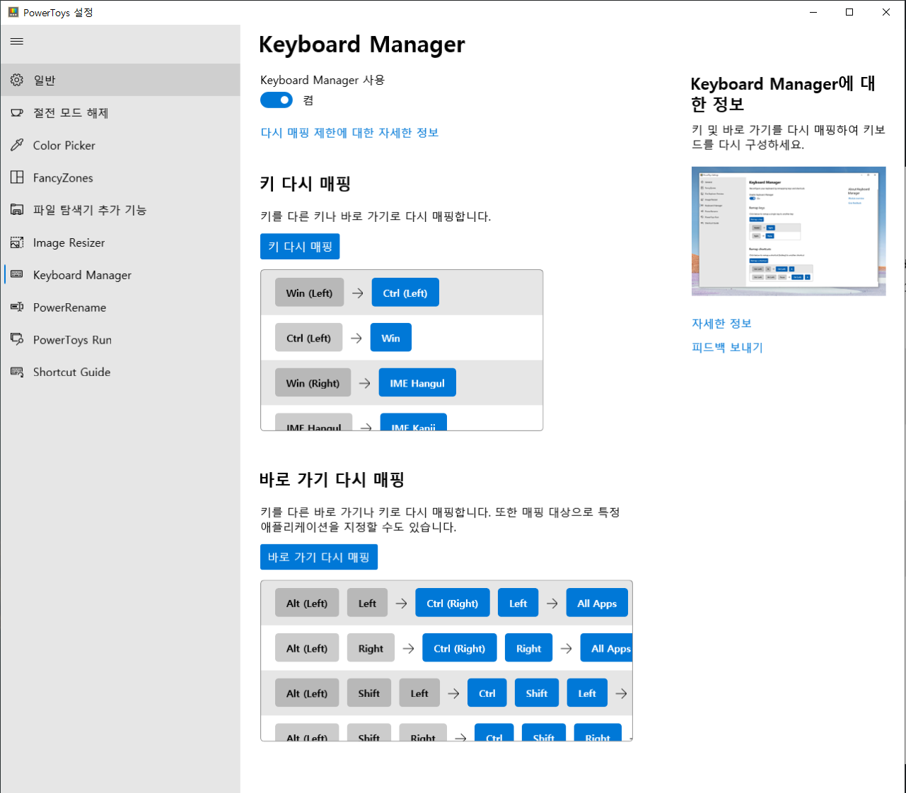
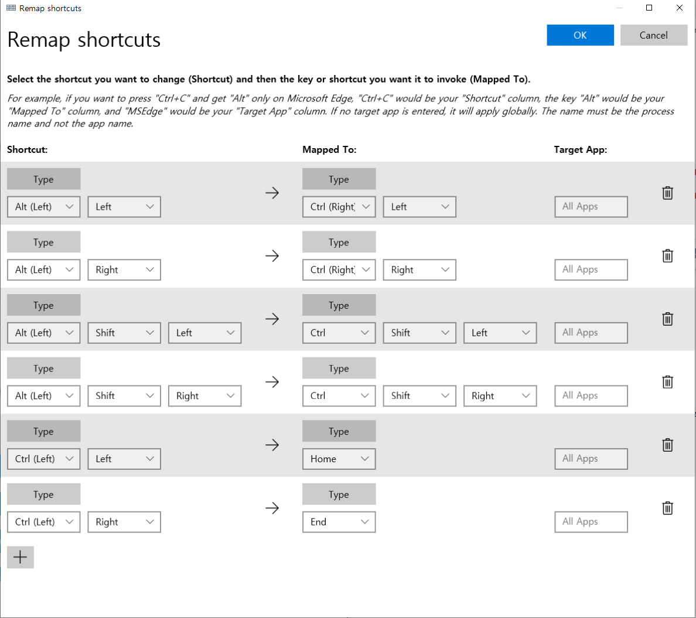

## keyboard mapping for windows

회사 작업, 개인 작업, 취미 등으로 인해 windows 와 mac OS 를 번갈아 가면서 쓰는 경우가 생깁니다.

OS 플랫폼별 단축키를 다르게 가져가는 것은 효율이 떨어지고 매번 다르게 적응하는 것은 귀찮은 일입니다.

하나의 OS 플랫폼에서 쓰는 혹은 본인만의 키 세팅 및 매크로로 통일하는 게 나을지도 모릅니다.

### PowerToys 로 키보드 셋팅

* mac OS 단축키를 windows 로 세팅

.PNG)

아래의 링크는 윈도우에서 키 셋팅 및 매크로 지정을 하기 위한 소프트웨어 입니다.

[`https://windowsreport.com/keyboard-mapping-software/`](https://windowsreport.com/keyboard-mapping-software/)

